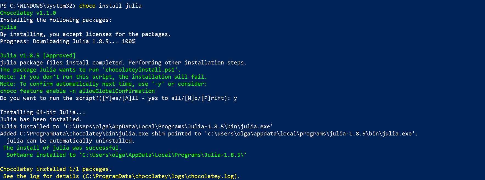
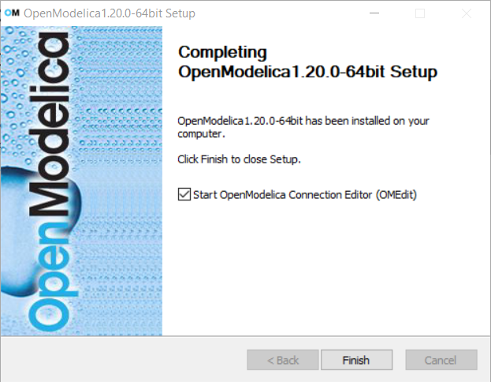
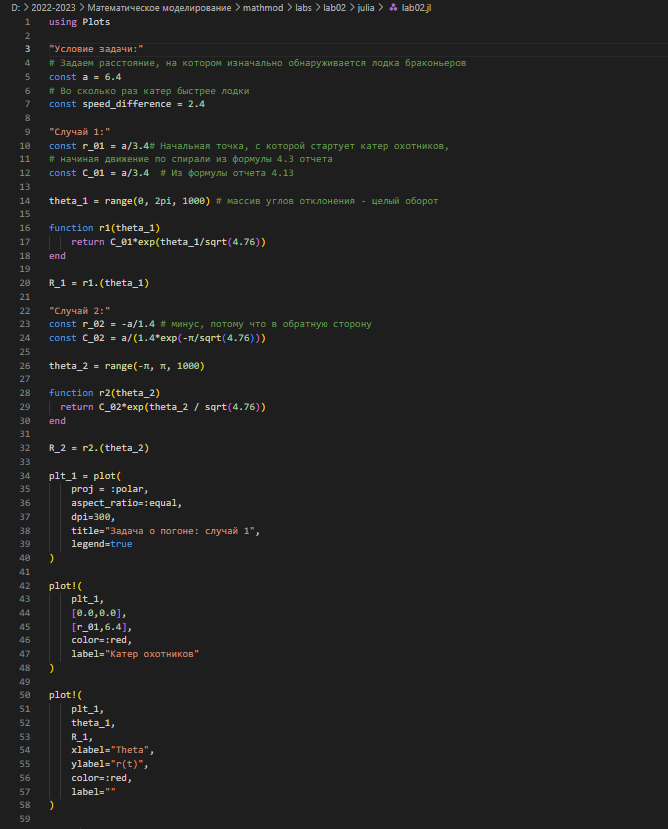
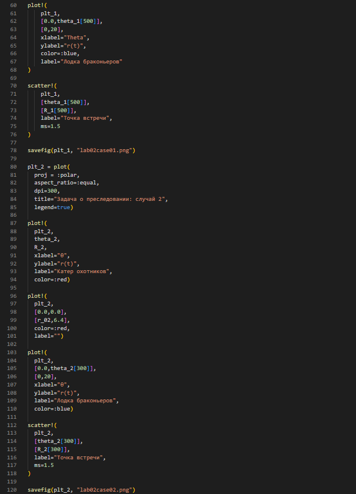
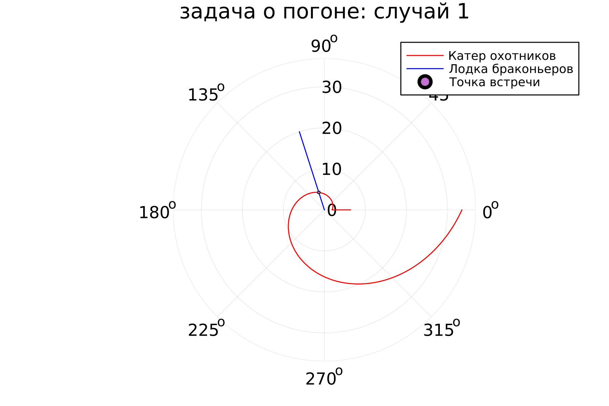
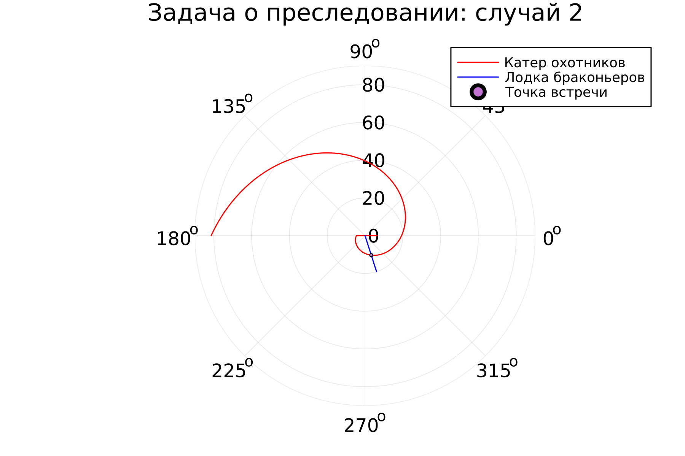

---
## Front matter
lang: ru-RU
title: Лабораторная работа №2
subtitle: Задача о погоне
author:
  - Губина О. В.
institute:
  - Российский университет дружбы народов, Москва, Россия
date: 18 февраля 2023

## i18n babel
babel-lang: russian
babel-otherlangs: english

## Formatting pdf
toc: false
toc-title: Содержание
slide_level: 2
aspectratio: 169
section-titles: true
theme: metropolis
header-includes:
 - \metroset{progressbar=frametitle,sectionpage=progressbar,numbering=fraction}
 - '\makeatletter'
 - '\beamer@ignorenonframefalse'
 - '\makeatother'
---

# Информация

## Докладчик

  * Губина Ольга Вячеславовна
  * студент(-ка) уч. группы НПИбд-01-20
  * Российский университет дружбы народов
  * [1032201737@pfur.ru](mailto:1032201737@rudn.ru)
  * <https://github.com/ovgubina>

# Вводная часть

## Актуальность

- Необходимость навыков моделирования реальных математических задач, построение графиков. 

## Объект и предмет исследования

- Задача о погоне
- Языки для моделирования:
  - Julia
  - OpenModelica

## Цели и задачи

- Изучить языки Julia и OpenModelica
- Смоделировать математическую задачу о погоне с помощью данных языков

## Материалы и методы

- Языки программирования:
  - Julia
  - OpenModelica

# Процесс выполнения работы

## Установка недостающих пакетов 

:::::::::::::: {.columns align=center}
::: {.column width="50%"}

:::
::: {.column width="50%"}

:::
::::::::::::::

## Данные варианта

*На море в тумане катер береговой охраны преследует лодку браконьеров.
Через определенный промежуток времени туман рассеивается, и лодка
обнаруживается на расстоянии 6,4 км от катера. Затем лодка снова скрывается в
тумане и уходит прямолинейно в неизвестном направлении. Известно, что скорость
катера в 2,4 раза больше скорости браконьерской лодки: $V_O=2.4V_B$.*

Браконьеры и охотники видят друг друга на расстоянии $a=6.4$ до наступления тумана.

Браконьеры двигаются по прямой в то время, как охотники движутся по спирали, чтобы нагнать браконьеров в любом случае, поскольку вторые движутся в неизвестном направлении.

## Вывод уравнения задачи - случай 1

$$
t=r_0/V_B=(a-r_0)/V_O=(a-r_0)/2.4V_B
$$ 
$$
r_0=a/3.4
$$ 
$$
r*d\theta/dt=\sqrt(4.76)V_B
$$ 
$$
dr/r=d\theta/sqrt(4.76)
$$
$$
r\left(\theta\right)=Ce^{\frac{\theta}{\sqrt{4.76}}}
$$ 
$$
C=r_0=a/3.4
$$ 
$$
r\left(\theta\right)=\frac{a}{3.4}e^{\frac{\theta}{\sqrt{4.76}}}
$$ 

## Вывод уравнения задачи - случай 2

$$
r_0/V_B=(a+r_0)/2.4V_B 
$$ 
$$
r_0=a/1.4
$$ 
$$
r\left(\theta\right)=Ce^{\frac{\theta}{\sqrt{4.76}}}=r_0
$$
$$
Ce^{\frac{\theta}{\sqrt{4.76}}}=\frac{a}{1.4}
$$
$$
C=\frac{a}{1.4e^{\frac{\theta}{\sqrt{4.76}}}}
$$

## Написание кода на Julia

:::::::::::::: {.columns align=center}
::: {.column width="50%"}

{width=70%}

:::
::: {.column width="50%"}

{width=70%}

:::
::::::::::::::

## Графики, полученные с помощью Julia

:::::::::::::: {.columns align=center}
::: {.column width="50%"}

{}

:::
::: {.column width="50%"}

{}

:::
::::::::::::::

## Моделирование на OpenModelica

OpenModelica не предназначена для решения подобного рода задач, только если с использованием нестандартных методов, поэтому данная задача представлена только на одном языке программирования. 

# Результаты работы

- Написала программу, моделирующую данную задачу на Julia
- Вывела графики движения в задаче в двух случаях

# Вывод

- Изучила языки Julia и OpenModelica
- Смоделировала математическую задачу о погоне с помощью Julia

[def]: ttps://github.com/ovgubina