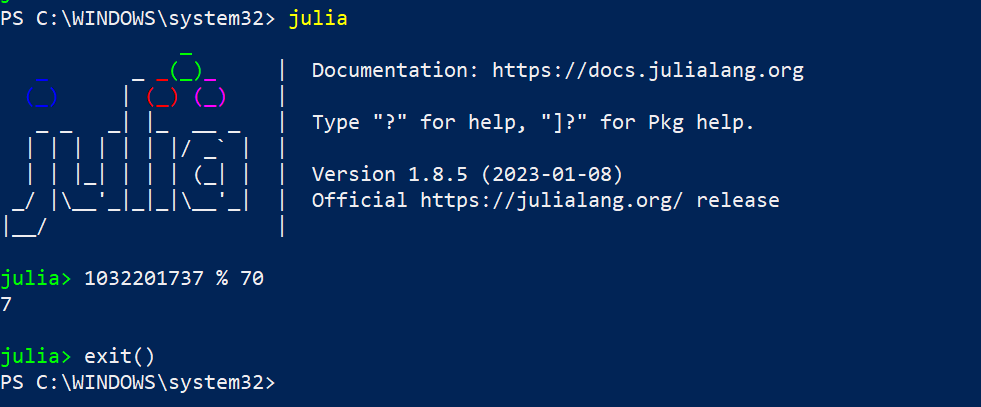
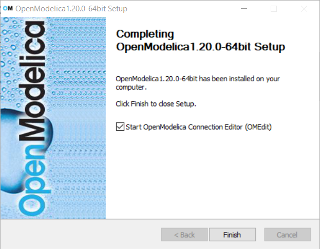
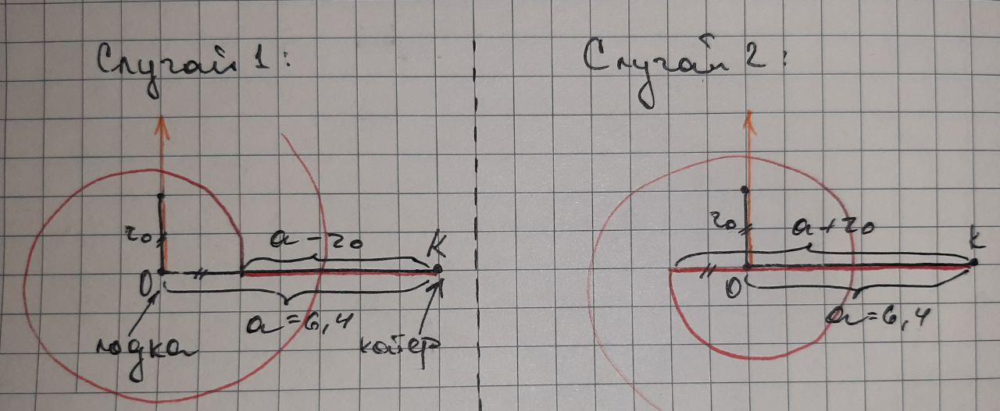
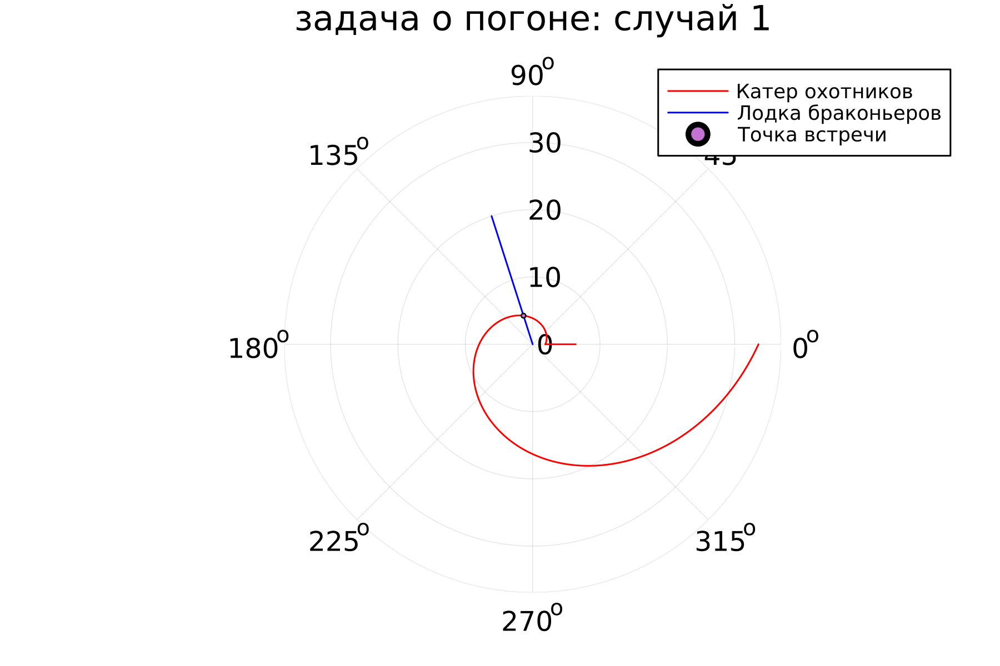
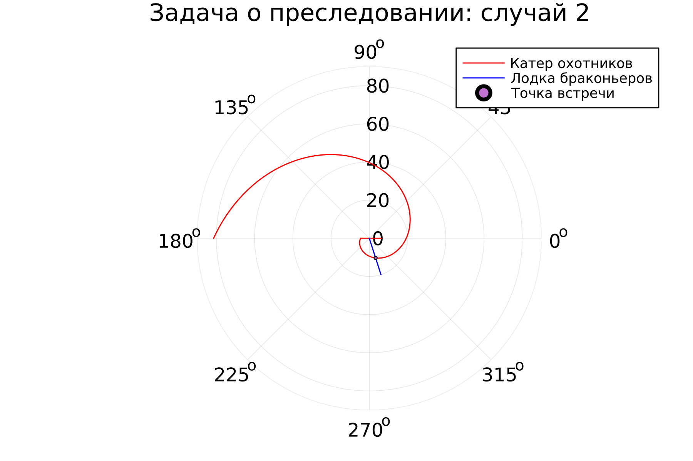

---
## Front matter
title: "Отчет по лабораторной работе №2"
subtitle: "Дисциплина: Математическое моделирование"
author: "Выполнила: Губина Ольга Вячеславовна"

## Generic otions
lang: ru-RU
toc-title: "Содержание"

## Bibliography
bibliography: bib/cite.bib
csl: pandoc/csl/gost-r-7-0-5-2008-numeric.csl

## Pdf output format
toc: true # Table of contents
toc-depth: 2
lof: true # List of figures
lot: true # List of tables
fontsize: 12pt
linestretch: 1.5
papersize: a4
documentclass: scrreprt
## I18n polyglossia
polyglossia-lang:
  name: russian
  options:
	- spelling=modern
	- babelshorthands=true
polyglossia-otherlangs:
  name: english
## I18n babel
babel-lang: russian
babel-otherlangs: english
## Fonts
mainfont: PT Serif
romanfont: PT Serif
sansfont: PT Sans
monofont: PT Mono
mainfontoptions: Ligatures=TeX
romanfontoptions: Ligatures=TeX
sansfontoptions: Ligatures=TeX,Scale=MatchLowercase
monofontoptions: Scale=MatchLowercase,Scale=0.9
## Biblatex
biblatex: true
biblio-style: "gost-numeric"
biblatexoptions:
  - parentracker=true
  - backend=biber
  - hyperref=auto
  - language=auto
  - autolang=other*
  - citestyle=gost-numeric
## Pandoc-crossref LaTeX customization
figureTitle: "Рис."
tableTitle: "Таблица"
listingTitle: "Листинг"
lofTitle: "Список иллюстраций"
lotTitle: "Список таблиц"
lolTitle: "Листинги"
## Misc options
indent: true
header-includes:
  - \usepackage{indentfirst}
  - \usepackage{float} # keep figures where there are in the text
  - \floatplacement{figure}{H} # keep figures where there are in the text
---

# Цель работы

**Цель работы:**
Изучить языки Julia и OpenModelica, освоить моделирование реальных математических задач с их помощью.

# Задание

1. Записать уравнение, описывающее движение катера, с начальными
условиями для двух случаев (в зависимости от расположения катера
относительно лодки в начальный момент времени).
2. Построить траекторию движения катера и лодки для двух случаев.
3. Найти точку пересечения траектории катера и лодки. 

# Теоретическое введение

В данной работе нам предстоит познакомиться с такими языками программи рования мат. вычислений как Julia и OpenModelica.

**Julia** — высокоуровневый высокопроизводительный свободный язык программирования с динамической типизацией, созданный для математических вычислений.[@julia] Эффективен также и для написания программ общего назначения. С документацией языка можно ознакомиться на официальном сайте в разделе документации.[@julia-doc]

**OpenModelica** — свободное открытое программное обеспечение для моделирования, симуляции, оптимизации и анализа сложных динамических систем. Основано на языке Modelica.

Активно развивается Open Source Modelica Consortium,некоммерческой неправительственной организацией. Open Source Modelica Consortium является совместным проектом RISE SICS East AB и Линчёпингского университета.

OpenModelica используется в академической среде и на производстве. В промышленности используется в области оптимизации энергоснабжения, автомобилестроении и водоочистке.

Включает блоки:
- механики
- электрики
- электроники
- электродвигатели
- гидравлики
- термодинамики
- элементы управления и т. д.

По своим возможностям приближается к таким вычислительным средам как Matlab Simulink, Scilab xCos, имея при этом значительно более удобное представление системы уравнений исследуемого блока (фактически без существенного преобразования и без сведения к форме Коши, остаётся лишь задать начальные условия и записать уравнения в скоростях).[@open-modelica]

# Выполнение лабораторной работы

1. Первое, что необходимо было сделать, это установить недостающие пакеты. Таким обрызом была произведена установка Julia через менеджер пакетов choco (рис. [@fig:01;@fig:02]) и OpenModelica через официальный установщик (рис. [@fig:03]).

{#fig:01 width=70%}

{#fig:02 width=70%}

{#fig:03 width=70%}

2. Далее будем выполнять вариант 7 предложенных вариантов задачи про погоню охотников и браконьеров:

*На море в тумане катер береговой охраны преследует лодку браконьеров.
Через определенный промежуток времени туман рассеивается, и лодка
обнаруживается на расстоянии 6,4 км от катера. Затем лодка снова скрывается в
тумане и уходит прямолинейно в неизвестном направлении. Известно, что скорость
катера в 2,4 раза больше скорости браконьерской лодки: $V_O=2.4V_B$.*

Браконьеры и охотники видят друг друга на расстоянии $a=6.4$ до наступления тумана.

Браконьеры двигаются по прямой в то время, как охотники движутся по спирали, чтобы нагнать браконьеров в любом случае, поскольку вторые движутся в неизвестном направлении.

3. Случай 1.

Для успешного перехвата охотники должны преодолеть расстояние $a-r_0$ по прямой и только после этого начать движение по спирали.

Тогда существует время $t$ - время, которое тратит лодка браконьеров на преодоление расстояния $r_0$, более того это время, которое тратит катер охотников на преодоление расстояния $a-r_0$ (см. формулу [@eq:01]).

$$
t=r_0/V_B=(a-r_0)/V_O=(a-r_0)/2.4V_B
$$ {#eq:01}

Из формулы [@eq:01] следует, что [@eq:02]:

$$
r_0/V_B=(a-r_0)/2.4V_B 
$$ {#eq:02}

Тогда, методом преобразований получим начальную точку, с которой стартует катер охотников, начиная движение по спирали для первого случая (см. формулу [@eq:03]).

$$
r_0=a/3.4
$$ {#eq:03}

После преодоления охотниками расстояния $a-r_0$ и по прошествии времени t браконьеры и охотники находятся на равном расстоянии от точки начала координат $О$ - точка начала движения браконьерской лодки. Теперь охотники могут начать движении по траектории, близкой к окружности, однако ее радиус постоянно увеличивается на Δr за время Δt.

Тогда: скорость катера охотников можно разложить на скорость тангенсальную $V_t$ (которая двигает охотников в сторону за браконьерами, движение по касательной) и на радиальную $V_r$ (которая двигает их от точки начала $О$ на то же расстояние, на которое движутся браконьеры $Δr$ за время $Δt$).

В таком случае $V_r=V_B$, чтобы катер охотников всегда находился на одном расстоянии от $О$, что и лодка браконьеров.

За время $Δt$ охотники проходят свою траекторию по радиусу $Δr$ - расстояние по прямой (формула [@eq:04])

$$
lim(Δt→0)Δr/Δt=V_O
$$ {#eq:04}

Из этого следует (формула [@eq:05]):

$$
dr/dt=V_r
$$ {#eq:05}

Существует угол $Δ\theta$ - угол между радиальной и тангенсальной скоростями охотников. Тогда (см. формулу [@eq:06]):

$$
lim(Δt→0)rΔ\theta/Δt=V_t 
$$ {#eq:06}

Из формулы [@eq:06] следует, что (формула [@eq:07]):

$$
r*d\theta/dt=V_t
$$ {#eq:07}

Из теоремы Пифагора (формула [@eq:08]):

$$
V_O^2=V_r^2+V_t^2→(2.4V_B)^2=V_B^2+V_t^2→4.76V_B^2=V_t^2
$$ {#eq:08}

В таком случае (формула [@eq:09]):

$$
V_t=\sqrt(4.76)V_B
$$ {#eq:09}

Тогда из [@eq:09] следует ([@eq:10]):

$$
dr/dt = V_B
$$ {#eq:10}

и [@eq:11]

$$
r*d\theta/dt=\sqrt(4.76)V_B
$$ {#eq:11}

Из [@eq:10] и [@eq:11] получим уравнение с разделяющимися переменными (см. формула [@eq:12]).

$$
dr/r=d\theta/sqrt(4.76)
$$ {#eq:12}

Отсюда получается (формула [-@eq:13]):

$$
r\left(\theta\right)=Ce^{\frac{\theta}{\sqrt{4.76}}}
$$ {#eq:13}

Из условия [-@eq:13]:

$$
C=r_0=a/3.4
$$ {#eq:14}

Итог (формула [-@eq:15]):

$$
r\left(\theta\right)=\frac{a}{3.4}e^{\frac{\theta}{\sqrt{4.76}}}
$$ {#eq:15}

4. Случай 2

Во втором случае у нас меняется расстояние, которое проходит катер охотников прежде чем начать движение по спирали, он идет в другую сторону и проходит расстояние равное $a+r_0$ - рис. [@fig:06].

{#fig:06 width=70%}

Браконьеры и охотники преодолевают расстояния равные $r_0$ и $a+r_0$ соответственно за равное время (формула [-@eq:16]):

$$
r_0/V_B=(a+r_0)/2.4V_B 
$$ {#eq:16}

Тогда, методом преобразований получим начальную точку, с которой стартует катер охотников, начиная движение по спирали для второго случая (см. формулу [-@eq:17]).

$$
r_0=a/1.4
$$ {#eq:17}

По аналогии с первым случаем имеем скорость тангенсальную $V_t$ и радиальную $V_r$. В таком случае $V_r=V_B$, чтобы катер охотников всегда находился на одном расстоянии от $O$, что и лодка браконьеров.

$$
r\left(\theta\right)=Ce^{\frac{\theta}{\sqrt{4.76}}}
$$ {#eq:18}

Исходя из формул [-@eq:17]-[-@eq:18] по аналогии с первым случаем:

$$
Ce^{\frac{\theta}{\sqrt{4.76}}}=\frac{a}{1.4}
$$ {#eq:19}

А значит для второго случая (см. формулу [-@eq:20]):

$$
C=\frac{a}{1.4e^{\frac{\theta}{\sqrt{4.76}}}}
$$ {#eq:20}

5. Теперь напишем программу на Julia, которая будет отрисовывать оба случая в графиках полярных координат, выделяя точку пересечения:

```
using Plots

"Условие задачи:"
# Задаем расстояние, на котором изначально обнаруживается лодка браконьеров
const a = 6.4
# Во сколько раз катер быстрее лодки
const speed_difference = 2.4

"Случай 1:"
const r_01 = a/3.4 # Начальная точка, с которой стартует катер охотников, 
# начиная движение по спирали из формулы 4.3 отчета
const C_01 = a/3.4 # Из формулы отчета 4.13

theta_1 = range(0, 2pi, 1000) # массив углов отклонения - целый оборот

function r1(theta_1)
    return C_01*exp(theta_1/sqrt(4.76))
end

R_1 = r1.(theta_1)

"Случай 2"
const r_02 = -a/1.4 # минус потому что в обратную сторону
const C_02 = a/(1.4*exp(-π/sqrt(4.76)))

theta_2 = range(-π, π, 1000)

function r2(theta_2)
  return C_02*exp(theta_2 / sqrt(4.76))
end

R_2 = r2.(theta_2)

plt_1 = plot(
    proj = :polar,
    aspect_ratio=:equal,
    dpi=300,
    title="задача о погоне: случай 1",
    legend=true
)

plot!(
    plt_1,
    [0.0,0.0],
    [r_01,6.4],
    color=:red,
    label="Катер охотников"
)

plot!(
    plt_1,
    theta_1,
    R_1,
    xlabel="Theta",
    ylabel="r(t)",
    color=:red,
    label=""
)

plot!(
    plt_1,
    [0.0,theta_1[300]],
    [0,20],
    xlabel="Theta",
    ylabel="r(t)",
    color=:blue,
    label="Лодка браконьеров"
)

scatter!(
    plt_1,
    [theta_1[300]],
    [R_1[300]],
    label="Точка встречи",
    ms=1.5
)

savefig(plt_1, "lab02case01.png")

plt_2 = plot(
  proj = :polar,
  aspect_ratio=:equal,
  dpi=300,
  title="Задача о преследовании: случай 2",
  legend=true)

plot!(
  plt_2,
  theta_2,
  R_2,
  xlabel="θ",
  ylabel="r(t)",
  label="Катер охотников",
  color=:red)

plot!(
  plt_2,
  [0.0,0.0],
  [r_02,6.4],
  color=:red,
  label="")
 
plot!(
  plt_2,
  [0.0,theta_2[300]],
  [0,20],
  xlabel="θ",
  ylabel="r(t)",
  label="Лодка браконьеров",
  color=:blue)

scatter!(
  plt_2,
  [theta_2[300]],
  [R_2[300]],
  label="Точка встречи",
  ms=1.5
)

savefig(plt_2, "lab02case02.png")

```

6. В качестве результата имеем следующие картинки, на которых все предельно ясно подписано (рис. [@fig:07]).

{#fig:07 width=70%}

{#fig:07 width=70%}

7. OpenModelica не предназначена для решения подобного рода задач, только если с использованием нестандартных методов, поэтому данная задача представлена только на одном языке программирования. 

# Выводы

Изучила языки Julia и OpenModelica, освоила моделирование реальных математических задач с помощью Julia.

# Список литературы{.unnumbered}

::: {#refs}
:::
