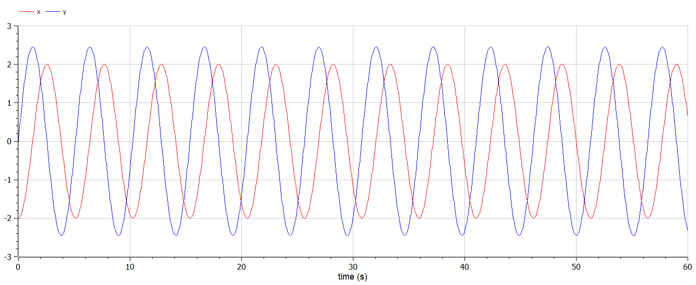
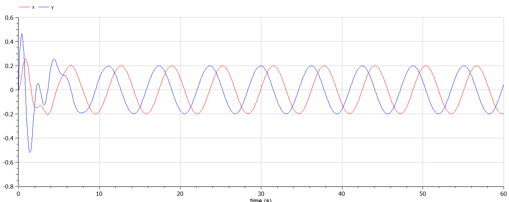

---
## Front matter
lang: ru-RU
title: Лабораторная работа №4
subtitle: Модель гармонических колебаний
author:
  - Губина О. В.
institute:
  - Российский университет дружбы народов, Москва, Россия
date: 4 марта 2023

## i18n babel
babel-lang: russian
babel-otherlangs: english

## Formatting pdf
toc: false
toc-title: Содержание
slide_level: 2
aspectratio: 169
section-titles: true
theme: metropolis
header-includes:
 - \metroset{progressbar=frametitle,sectionpage=progressbar,numbering=fraction}
 - '\makeatletter'
 - '\beamer@ignorenonframefalse'
 - '\makeatother'
---

# Информация

## Докладчик

  * Губина Ольга Вячеславовна
  * студент(-ка) уч. группы НПИбд-01-20
  * Российский университет дружбы народов
  * [1032201737@pfur.ru](mailto:1032201737@rudn.ru)
  * <https://github.com/ovgubina>

# Вводная часть

## Актуальность

- Необходимость навыков моделирования реальных математических задач, построение графиков. 

## Объект и предмет исследования

- Модель гармонических колебаний
- Языки для моделирования:
  - Julia
  - OpenModelica

## Цели и задачи

- Построить фазовый портрет гармонического осциллятора и решение уравнения
гармонического осциллятора для трех случаев:
  - Колебания гармонического осциллятора без затуханий и без действий внешней силы
  - Колебания гармонического осциллятора c затуханием и без действий внешней силы
  - Колебания гармонического осциллятора c затуханием и под действием внешней силы
- Выполнить задачу на заданном интервале

## Материалы и методы

- Языки для моделирования:
  - Julia
  - OpenModelica

# Процесс выполнения работы

## Теория

$$
\ddot x(t) + a\dot x(t) + bx = F(t)
$$ 
$$
\begin{aligned}
y = \frac{dx}{dt} = \dot x(t)
\\
\frac{d^2x}{dt^2} = \frac{dy}{dt}
\\
\frac{dy}{dt} + ay(t) + bx(t) = 0
\end{aligned}
$$ 
$$
\begin{cases}
  \frac{dx}{dt} = y
  \\
  \frac{dy}{dt} = -ay - bx
\end{cases}
$$ 

## Условие модели №1

- Колебания гармонического осциллятора без затуханий и без действий внешней силы 

$$
\ddot x +1.5x=0
$$

## Теория модели №1

Общий вид первого случая: $\ddot x + bx = 0$, где $b = \omega^2_0 = 1.5$.

Тогда система ОДУ первого порядка для решения задачи:

$$
\begin{cases}
  \dot x = y
  \\
  \dot y = -1.5x
\end{cases}
$$ 

## Условие модели №2

- Колебания гармонического осциллятора c затуханием и без действий внешней силы 

$$
\ddot x + \dot x +10x = 0
$$

## Теория модели №2

Общий вид второго случая: $\ddot x + ay + bx = 0$, где $a = 2\gamma = 1$ и $b = \omega^2_0 = 10$.

Тогда система ОДУ первого порядка для решения задачи:

$$
\begin{cases}
  \dot x = y
  \\
  \dot y = -y -10x
\end{cases}
$$

## Условие модели №3

- Колебания гармонического осциллятора c затуханием и под действием внешней силы $\ddot x + \dot x +11x = 2\cos(t)$

## Теория модели №3

Общий вид третьего случая: $\ddot x + ay + bx = F(t)$, где $a = 2\gamma = 1$, $b = \omega^2_0 = 11$ и $F(t) = 2\cos(t)$.

Тогда система ОДУ первого порядка для решения задачи:

$$
\begin{cases}
  \dot x = y
  \\
  \dot y = 2\cos(t) -y -11x
\end{cases}
$$ 

## Код на Julia

:::::::::::::: {.columns align=center}
::: {.column width="30%"}

:::
::: {.column width="30%"}

:::
::: {.column width="30%"}

:::
::::::::::::::

## Код на OpenModelica

:::::::::::::: {.columns align=center}
::: {.column width="30%"}

:::
::: {.column width="30%"}

:::
::: {.column width="30%"}

:::
::::::::::::::

## Графики Julia - случай 1

:::::::::::::: {.columns align=center}
::: {.column width="50%"}

:::
::: {.column width="50%"}

:::
::::::::::::::

## Графики OpenModelica - случай 1

:::::::::::::: {.columns align=center}
::: {.column width="50%"}

:::
::: {.column width="50%"}

:::
::::::::::::::

## Графики OpenModelica - другие значения - случай 1

:::::::::::::: {.columns align=center}
::: {.column width="50%"}

:::
::: {.column width="50%"}

:::
::::::::::::::

## Графики Julia - случай 2

:::::::::::::: {.columns align=center}
::: {.column width="50%"}

:::
::: {.column width="50%"}

:::
::::::::::::::

## Графики OpenModelica - случай 2

:::::::::::::: {.columns align=center}
::: {.column width="50%"}

:::
::: {.column width="50%"}

:::
::::::::::::::

## Графики OpenModelica - другие значения - случай 2

:::::::::::::: {.columns align=center}
::: {.column width="50%"}

:::
::: {.column width="50%"}

:::
::::::::::::::

## Графики Julia - случай 3

:::::::::::::: {.columns align=center}
::: {.column width="50%"}

:::
::: {.column width="50%"}

:::
::::::::::::::

## Графики OpenModelica - случай 3

:::::::::::::: {.columns align=center}
::: {.column width="50%"}

:::
::: {.column width="50%"}

:::
::::::::::::::

## Графики OpenModelica - другие значения - случай 3

:::::::::::::: {.columns align=center}
::: {.column width="50%"}

:::
::: {.column width="50%"}

:::
::::::::::::::

# Результаты работы

- Построить фазовый портрет гармонического осциллятора и решение уравнения
гармонического осциллятора для трех случаев:
  - Колебания гармонического осциллятора без затуханий и без действий внешней силы
  - Колебания гармонического осциллятора c затуханием и без действий внешней силы
  - Колебания гармонического осциллятора c затуханием и под действием внешней силы
- Выполнить задачу на заданном интервале

# Вывод

Создала модель гармонический колебаний по средствам языков Julia и OpenModelica.

[def]: ttps://github.com/ovgubina