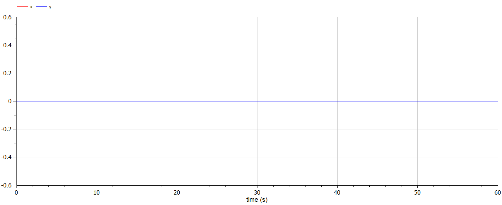
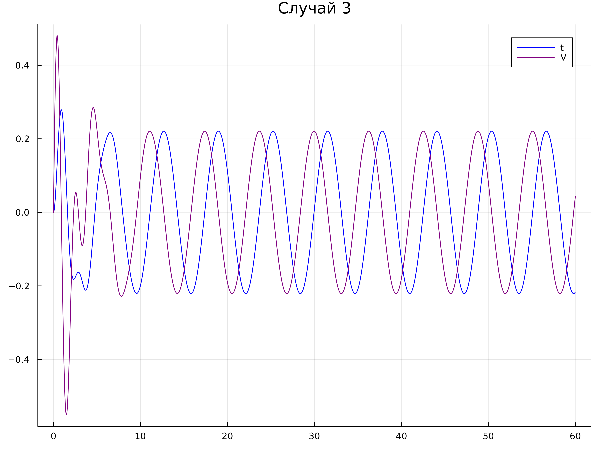

---
## Front matter
title: "Отчет по лабораторной работе №4"
subtitle: "Дисциплина: Математическое моделирование"
author: "Выполнила: Губина Ольга Вячеславовна"

## Generic otions
lang: ru-RU
toc-title: "Содержание"

## Bibliography
bibliography: bib/cite.bib
csl: pandoc/csl/gost-r-7-0-5-2008-numeric.csl

## Pdf output format
toc: true # Table of contents
toc-depth: 2
lof: true # List of figures
lot: true # List of tables
fontsize: 12pt
linestretch: 1.5
papersize: a4
documentclass: scrreprt
## I18n polyglossia
polyglossia-lang:
  name: russian
  options:
	- spelling=modern
	- babelshorthands=true
polyglossia-otherlangs:
  name: english
## I18n babel
babel-lang: russian
babel-otherlangs: english
## Fonts
mainfont: PT Serif
romanfont: PT Serif
sansfont: PT Sans
monofont: PT Mono
mainfontoptions: Ligatures=TeX
romanfontoptions: Ligatures=TeX
sansfontoptions: Ligatures=TeX,Scale=MatchLowercase
monofontoptions: Scale=MatchLowercase,Scale=0.9
## Biblatex
biblatex: true
biblio-style: "gost-numeric"
biblatexoptions:
  - parentracker=true
  - backend=biber
  - hyperref=auto
  - language=auto
  - autolang=other*
  - citestyle=gost-numeric
## Pandoc-crossref LaTeX customization
figureTitle: "Рис."
tableTitle: "Таблица"
listingTitle: "Листинг"
lofTitle: "Список иллюстраций"
lotTitle: "Список таблиц"
lolTitle: "Листинги"
## Misc options
indent: true
header-includes:
  - \usepackage{indentfirst}
  - \usepackage{float} # keep figures where there are in the text
  - \floatplacement{figure}{H} # keep figures where there are in the text
---

# Цель работы

Создать модель гармонический колебаний по средствам языков Julia и OpenModelica.

# Задание

- Построить фазовый портрет гармонического осциллятора и решение уравнения
гармонического осциллятора для трех случаев:
  - Колебания гармонического осциллятора без затуханий и без действий внешней силы
  - Колебания гармонического осциллятора c затуханием и без действий внешней силы
  - Колебания гармонического осциллятора c затуханием и под действием внешней силы
- Выполнить задачу на заданном интервале

# Теоретическое введение

Движение грузика на пружинке, маятника, заряда в электрическом контуре, а
также эволюция во времени многих систем в физике, химии, биологии и других
науках при определенных предположениях можно описать одним и тем же
дифференциальным уравнением, которое в теории колебаний выступает в качестве
основной модели. Эта модель называется линейным гармоническим осциллятором.

Уравнение свободных колебаний гармонического осциллятора имеет
следующий вид (формула [-@eq:01]):

$$
\ddot x+2\gamma\dot x+\omega^2_0x=0
$$ {#eq:01}

где x – переменная, описывающая состояние системы (смещение грузика, заряд
конденсатора и т.д.), $\gamma$ – параметр, характеризующий потери энергии (трение в
механической системе, сопротивление в контуре), $\omega_0$ – собственная частота
колебаний, $t$ – время. (Обозначения $\ddot x = \frac{d^2x}{dt^2}$, $\dot x = \frac{dx}{dt}$)

Уравнение [-@eq:01] есть линейное однородное дифференциальное уравнение
второго порядка и оно является примером линейной динамической системы.
При отсутствии потерь в системе ( $\gamma = 0$
) вместо уравнения [-@eq:01] получаем
уравнение консервативного осциллятора энергия колебания которого сохраняется
во времени (формула [-@eq:02]).

$$
\ddot x + \omega^2_0x = 0
$$ {#eq:02}

Для однозначной разрешимости уравнения второго порядка [-@eq:02] необходимо
задать два начальных условия вида:

$$
\begin{cases}
x(t_0) = x_0
\\
\dot x(t_0) = y_0
\end{cases}
$$ {#eq:03}

Уравнение второго порядка [-@eq:02] можно представить в виде системы двух
уравнений первого порядка:

$$
\begin{cases}
\dot x = y
\\
\dot y = -\omega^2_0x
\end{cases}
$$ {#eq:04}

Начальные условия [-@eq:03] для системы [-eq:04] примут вид:

$$
\begin{cases}
x(t_0) = x_0
\\
y(t_0) = y_0
\end{cases}
$$ {#eq:05}

Независимые переменные $x$, $y$ определяют пространство, в котором
«движется» решение. Это фазовое пространство системы, поскольку оно двумерно
будем называть его фазовой плоскостью.

Значение фазовых координат $x$, $y$ в любой момент времени полностью
определяет состояние системы. Решению уравнения движения как функции
времени отвечает гладкая кривая в фазовой плоскости. Она называется фазовой
траекторией. Если множество различных решений (соответствующих различным
начальным условиям) изобразить на одной фазовой плоскости, возникает общая
картина поведения системы. Такую картину, образованную набором фазовых
траекторий, называют фазовым портретом[@esys].


# Выполнение лабораторной работы

1. К выполнению нам предлагается выполнить соответстующий номеру студенчесткого билета вариант: 1032201737 % 70 + 1 = 8

2. Задача предложенного варианта состоит в следующем:

Постройте фазовый портрет[@faze] гармонического осциллятора[@osc] и решение уравнения гармонического осциллятора для следующих случаев

- Колебания гармонического осциллятора без затуханий и без действий внешней силы $\ddot x +1.5x=0$

- Колебания гармонического осциллятора c затуханием и без действий внешней силы $\ddot x + \dot x +10x = 0$

- Колебания гармонического осциллятора c затуханием и под действием внешней силы $\ddot x + \dot x +11x = 2\cos(t)$

На интервале $t \in [0; 60]$ (шаг 0.05) с начальными условиями $x_0 = 0$, $y_0=0$.


3. В общем виде можем записать наше однородное ОДУ второго порядка следующим образом:

$$
\frac{d^2x(t)}{dt^2} + a\frac{dx}{dt} + bx(t) = F(t)
$$ {#eq:06}

где $\frac{dx}{dt} = \dot x$ - производная по времени:

$$
\ddot x(t) + a\dot x(t) + bx = F(t)
$$ {#eq:07}

Можно сделать систему ОДУ:

$$
\begin{aligned}
y = \frac{dx}{dt} = \dot x(t)
\\
\frac{d^2x}{dt^2} = \frac{dy}{dt}
\\
\frac{dy}{dt} + ay(t) + bx(t) = 0
\end{aligned}
$$ {#eq:08}

Тогда система для решения:

$$
\begin{cases}
  \frac{dx}{dt} = y
  \\
  \frac{dy}{dt} = -ay - bx
\end{cases}
$$ {#eq:09}

4. **Первый случай** - колебания гармонического осциллятора без затуханий и без действий внешней силы $\ddot x +1.5x=0$ .

Отсюда видим, что $a = 0$ и $F(t) = 0$.

Если $F(t) = 0$ и $b \ne 0$, значит есть трение и система затухнет.

Если $F(t) = 0$ и $b = 0$, то трения нет.

Если $F(t) \ne 0$, то система никогда не затухнет, но энергия будет уходить на силу трения за счет внешней силы.

Общий вид первого случая: $\ddot x + bx = 0$, где $b = \omega^2_0 = 1.5$.

Тогда система ОДУ первого порядка для решения задачи:

$$
\begin{cases}
  \dot x = y
  \\
  \dot y = -1.5x
\end{cases}
$$ {#eq:10}

Код для первого случая на Julia:

```
using Plots
using DifferentialEquations

"Условия:"
x_0 = 0
y_0 = 0

u_0 = [x_0, y_0]
T = (0.0, 60.0) # отслеживаемый промежуток времени

b = 1.5

function F!(du, u, p, t)
	du[1] = u[2]
	du[2] = -b*u[1]
end

prob = ODEProblem(F!, u_0, T)
sol = solve(prob, saveat = 0.05) # обозначили шаг

const X = Float64[]
const Y = Float64[]

for u in sol.u
	x, y = u
	push!(X, x)
	push!(Y, y)
end

plt = plot(
	dpi = 300,
	size = (800, 600),
	title = "Случай 1"
)

plot!(
	plt,
	X,
	Y,
	color = :red,
	label = "Фазовый портрет"
)

savefig(plt, "case01_faze.png")

plt_2 = plot(
	dpi = 300,
	size = (800, 600),
	title = "Случай 1"
)

plot!(
	plt_2,
	sol.t,
	X,
	color = :blue,
	label = "t"
)

plot!(
	plt_2,
	sol.t,
	Y,
	color = :purple,
	label = "V"
)

savefig(plt_2, "case01.png")
```

График для первого случая - Julia (рис. [@fig:01]):

{#fig:01 width=70%}

Фазовый портрет Julia (рис. [@fig:02]):

{#fig:02 width=70%}

Код для первого случая на OpenModelica:

```
model lab04_case01
  constant Integer x_0 = 0;
  constant Integer y_0 = 0;
  constant Real b = 1.5;
  Real x(start=x_0);
  Real y(start=y_0);
  Real t = time;
equation
  der(x) = y;
  der(y) = -b*x;
  annotation(experiment(StartTime = 0, StopTime = 60.0),
    Documentation);
end lab04_case01;
```

Чтобы выставить на OpenModelica шаг в 0.05 призапуске отметим это (рис. [@fig:20]):

{#fig:20 width=70%}

График для первого случая - OpenModelica (рис. [@fig:03]):

{#fig:03 width=70%}

Фазовый портрет OpenModelica (рис. [@fig:04]):

{#fig:04 width=70%}

Теперь построим те же графики в OpenModelica, но с начальными значениями $x_0 = -2$ и $y_0 = 0$ (рис. [@fig:05]-[@fig:06]).

{#fig:05 width=70%}

{#fig:06 width=70%}

5. **Второй случай** - колебания гармонического осциллятора c затуханием и без действий внешней силы $\ddot x + \dot x +10x = 0$

Отсюда видим, что $F(t) = 0$.

Общий вид второго случая: $\ddot x + ay + bx = 0$, где $a = 2\gamma = 1$ и $b = \omega^2_0 = 10$.

Тогда система ОДУ первого порядка для решения задачи:

$$
\begin{cases}
  \dot x = y
  \\
  \dot y = -y -10x
\end{cases}
$$ {#eq:11}

Код для второго случая на Julia:

```
using Plots
using DifferentialEquations

"Условие:"
x_0 = 0 
y_0 = 0 

u_0= [x_0, y_0] 
T = (0.0, 60.0) # отслеживаемый период времени

a = 1.0
b = 10.0

function F!(du, u, p, t) # система уравнений
	du[1] = u[2]
	du[2] = -a*u[2]-b*u[1]
end

prob = ODEProblem(F!, u_0, T)
sol = solve(prob, saveat=0.05) # в saveat обозначили шаг

const X = Float64[]
const Y = Float64[]

for u in sol.u
	x, y = u
	push!(X, x)
	push!(Y, y)
end

plt = plot(
	dpi = 300,
	size = (800,600),
	title = "Случай 2"
)

plot!(
	plt,
	X,
	Y,
	color=:red,
	label = "Фазовый портрет"
)

savefig(plt, "case02_faze.png")

plt_2 = plot(
	dpi = 300,
	size = (800,600),
	title = "Случай 2"
)

plot!(
	plt_2,
	sol.t,
	X,
	color=:blue,
	label = "t"
)

plot!(
	plt_2,
	sol.t,
	Y,
	color=:purple,
	label = "V"
)

savefig(plt_2, "case02.png")

```

График для второго случая Julia (рис. [@fig:07]).

{#fig:07 width=70%}

Фазовый портрет второго случая Julia (рис. [@fig:08]).

{#fig:08 width=70%}

Код для второго случая OpenModelica

```
model lab04_case02
  constant Integer x_0 = 0;
  constant Integer y_0 = 0;
  constant Real a = 1.0;
  constant Real b = 10.0;
  Real x(start=x_0);
  Real y(start=y_0);
  Real t = time;
equation
  der(x) = y;
  der(y) = -a*y-b*x;
  annotation(experiment(StartTime = 0, StopTime = 60.0),
    Documentation);
end lab04_case02;
```

График для второго случая OpenModelica (рис. [@fig:09]).

{#fig:09 width=70%}

Фазовый портрет второго случая OpenModelica (рис. [@fig:10]).

{#fig:10 width=70%}

Теперь построим те же графики в OpenModelica, но с начальными значениями $x_0 = -2$ и $y_0 = 0$ (рис. [@fig:11]-[@fig:12]).

{#fig:11 width=70%}

{#fig:12 width=70%}

6. **Третий случай** - колебания гармонического осциллятора c затуханием и под действием внешней силы $\ddot x + \dot x +11x = 2\cos(t)$

Отсюда видим, что $F(t) = 2\cos(t)$.

Общий вид третьего случая: $\ddot x + ay + bx = F(t)$, где $a = 2\gamma = 1$, $b = \omega^2_0 = 11$ и $F(t) = 2\cos(t)$.

Тогда система ОДУ первого порядка для решения задачи:

$$
\begin{cases}
  \dot x = y
  \\
  \dot y = 2\cos(t) -y -11x
\end{cases}
$$ {#eq:12}

Код для третьего случая Julia

```
using Plots
using DifferentialEquations

"Условие:"
x_0 = 0 
y_0 = 0 

u_0= [x_0, y_0] 
T = (0.0, 60.0) # отслеживаемый период времени

a = 1.0
b = 10.0

function F(t)
	return 2*cos(t)
end

function Fu!(du, u, p, t) # система уравнений
	du[1] = u[2]
	du[2] = F(t) - a*u[2] - b*u[1]
end

prob = ODEProblem(Fu!, u_0, T)
sol = solve(prob, saveat=0.05) # в saveat обозначили шаг

const X = Float64[]
const Y = Float64[]

for u in sol.u
	x, y = u
	push!(X, x)
	push!(Y, y)
end

plt = plot(
	dpi = 300,
	size = (800,600),
	title = "Случай 3"
)

plot!(
	plt,
	X,
	Y,
	color=:red,
	label = "Фазовый портрет"
)

savefig(plt, "case03_faze.png")

plt_2 = plot(
	dpi = 300,
	size = (800,600),
	title = "Случай 3"
)

plot!(
	plt_2,
	sol.t,
	X,
	color=:blue,
	label = "t"
)

plot!(
	plt_2,
	sol.t,
	Y,
	color=:purple,
	label = "V"
)

savefig(plt_2, "case03.png")

```

График для третьего случая Julia (рис. [@fig:13]).

{#fig:13 width=70%}

Фазовый портрет третьего случая Julia (рис. [@fig:14]).

{#fig:14 width=70%}

```
model lab04_case03
  constant Integer x_0 = 0;
  constant Integer y_0 = 0;
  constant Real a = 1.0;
  constant Real b = 11.0;
  Real x(start=x_0);
  Real y(start=y_0);
  Real t = time;
equation
  der(x) = y;
  der(y) = 2*cos(t)-a*y-b*x;
  annotation(experiment(StartTime = 0, StopTime = 60.0),
    Documentation);
end lab04_case03;

```

График для третьего случая OpenModelica (рис. [@fig:15]).

{#fig:15 width=70%}

Фазовый портрет третьего случая OpenModelica (рис. [@fig:16]).

{#fig:16 width=70%}

Теперь построим те же графики в OpenModelica, но с начальными значениями $x_0 = -2$ и $y_0 = 0$ (рис. [@fig:17]-[@fig:18]).

{#fig:17 width=70%}

{#fig:18 width=70%}

# Выводы

Создала модель гармонический колебаний по средствам языков Julia и OpenModelica.

# Список литературы{.unnumbered}

::: {#refs}
:::
