---
## Front matter
lang: ru-RU
title: Лабораторная работа №5
subtitle: Модель "хищник-жертва"
author:
  - Губина О. В.
institute:
  - Российский университет дружбы народов, Москва, Россия
date: 8 марта 2023

## i18n babel
babel-lang: russian
babel-otherlangs: english

## Formatting pdf
toc: false
toc-title: Содержание
slide_level: 2
aspectratio: 169
section-titles: true
theme: metropolis
header-includes:
 - \metroset{progressbar=frametitle,sectionpage=progressbar,numbering=fraction}
 - '\makeatletter'
 - '\beamer@ignorenonframefalse'
 - '\makeatother'
---

# Информация

## Докладчик

  * Губина Ольга Вячеславовна
  * студент(-ка) уч. группы НПИбд-01-20
  * Российский университет дружбы народов
  * [1032201737@pfur.ru](mailto:1032201737@rudn.ru)
  * <https://github.com/ovgubina>

# Вводная часть

## Актуальность

- Необходимость навыков моделирования реальных математических задач, построение графиков. 

## Объект и предмет исследования

- Модель взаимодействия двух видов типа «хищник — жертва» - модель Лотки-Вольтерры
- Языки для моделирования:
  - Julia
  - OpenModelica

## Цели и задачи

Для модели «хищник-жертва»:

- Построить график зависимости численности хищников от численности жертв
- Построить графики изменения численности хищников и численности жертв при заданных начальных условиях
- Найдите стационарное состояние системы

## Материалы и методы

- Языки для моделирования:
  - Julia
  - OpenModelica

# Процесс выполнения работы

## Теория

$$
\begin{cases}
	\frac{dx}{dt} = ax(t) - bx(t)y(t)
	\\
	\frac{dy}{dt} = -cy(t) + dx(t)y(t)
\end{cases}
$$ 
В этой модели $x$ – число жертв, $y$ - число хищников. Коэффициент $a$
описывает скорость естественного прироста числа жертв в отсутствие хищников, $с$ - естественное вымирание хищников, лишенных пищи в виде жертв. Вероятность взаимодействия жертвы и хищника считается пропорциональной как количеству жертв, так и числу самих хищников $(xy)$. Каждый акт взаимодействия уменьшает популяцию жертв, но способствует увеличению популяции хищников (члены $-bxy$ и $dxy$ в правой части уравнения).

## Условие задачи

Для модели «хищник-жертва»:

$$
\begin{cases}
	\frac{dx}{dt} = -0.19x(t) + 0.048x(t)y(t)
	\\
	\frac{dy}{dt} = 0.39y(t) - 0.036x(t)y(t)
\end{cases}
$$

Постройте график зависимости численности хищников от численности жертв,
а также графики изменения численности хищников и численности жертв при
следующих начальных условиях: $x_0=13$, $y_0=18$. Найдите стационарное
состояние системы.

## Теория модели с данными условиями

В данном случае y - число жертв, x - число хищников. Тогда, из условия коэффициенты имеют следующие значения: $a = 0.39$, $b = 0.036$, $c = 0.19$, $d = 0.048$.

А уравнение имеет следующий вид:

$$
\begin{cases}
	\frac{dx}{dt} = -cx(t) + dx(t)y(t)
	\\
	\frac{dy}{dt} = ay(t) - bx(t)y(t)
\end{cases}
$$

## Код на Julia

:::::::::::::: {.columns align=center}
::: {.column width="50%"}

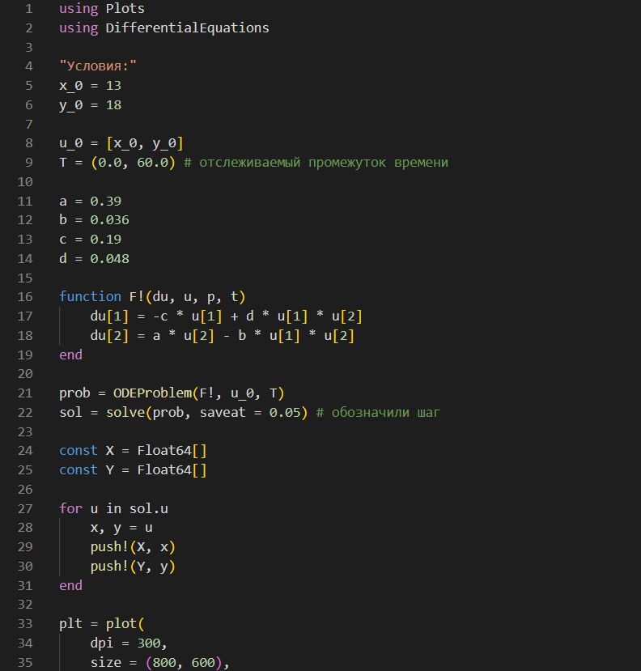

:::
::: {.column width="50%"}

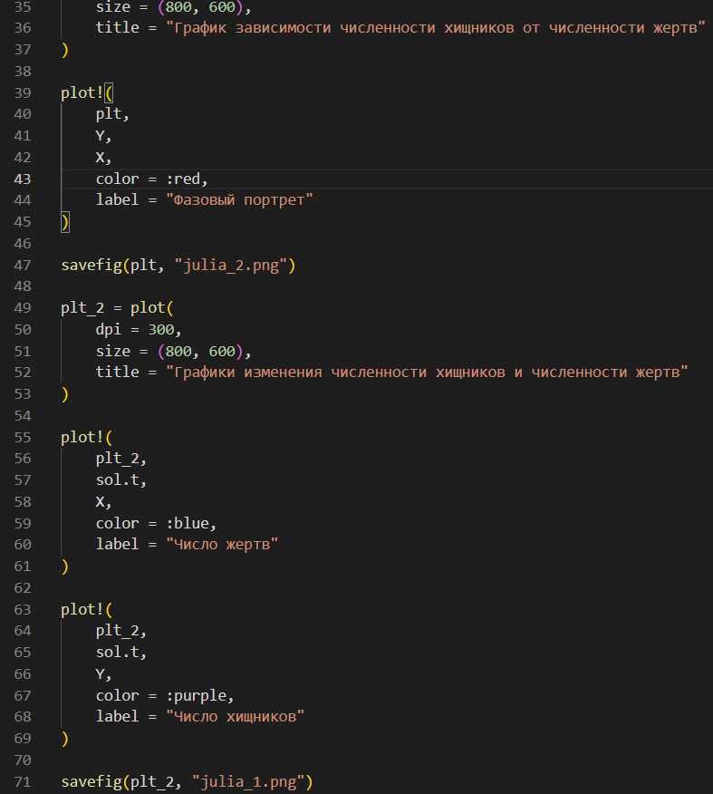

:::
::::::::::::::

## Код на OpenModelica

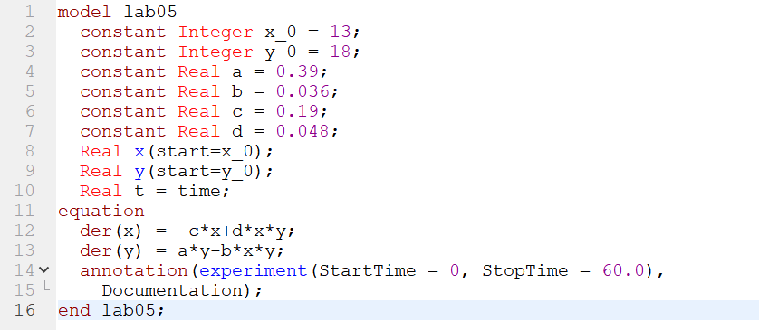

## Графики Julia

:::::::::::::: {.columns align=center}
::: {.column width="50%"}

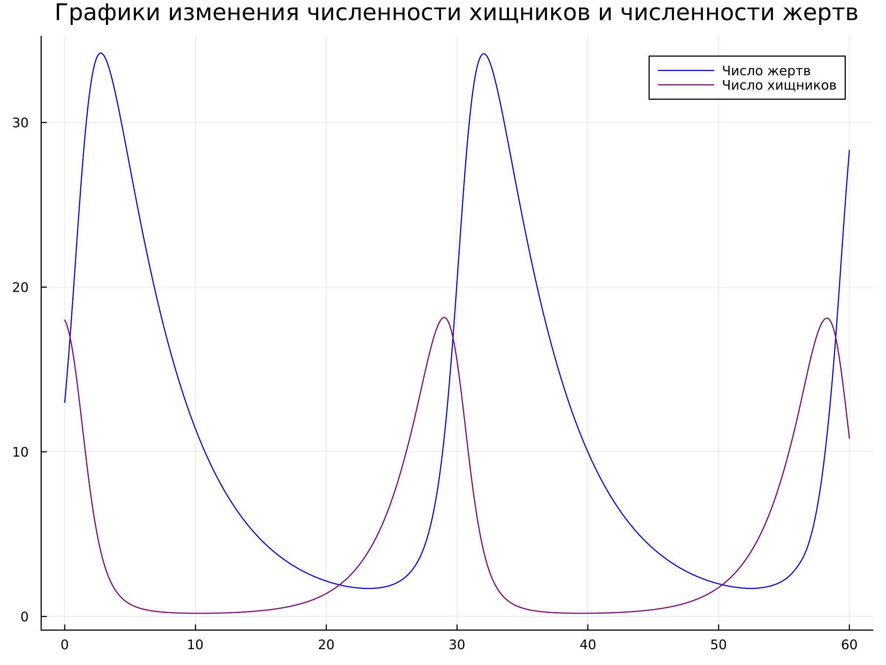

:::
::: {.column width="50%"}

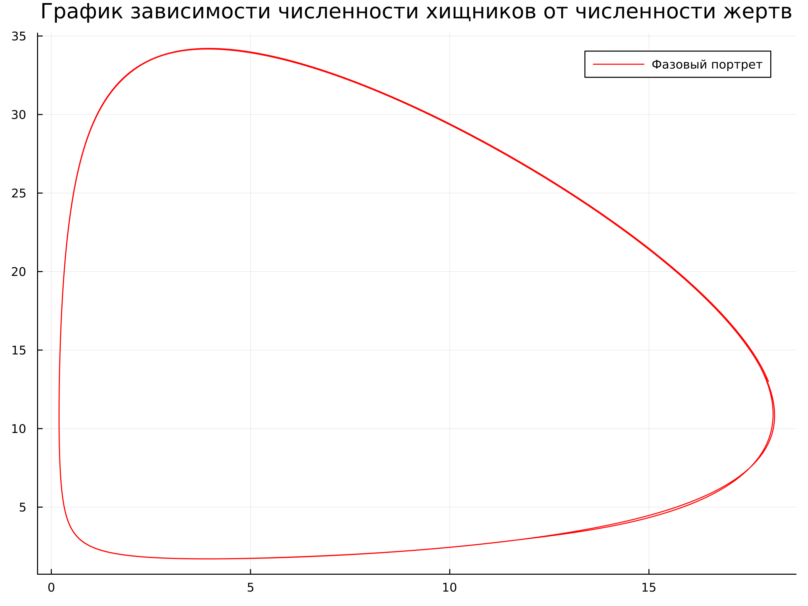
:::
::::::::::::::

## Графики OpenModelica

:::::::::::::: {.columns align=center}
::: {.column width="50%"}

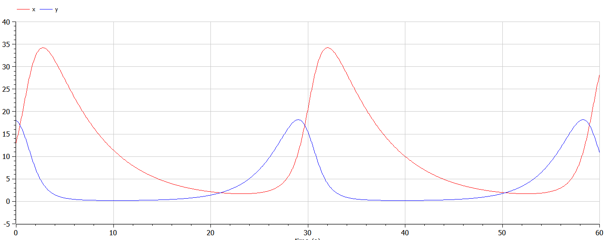

:::
::: {.column width="50%"}

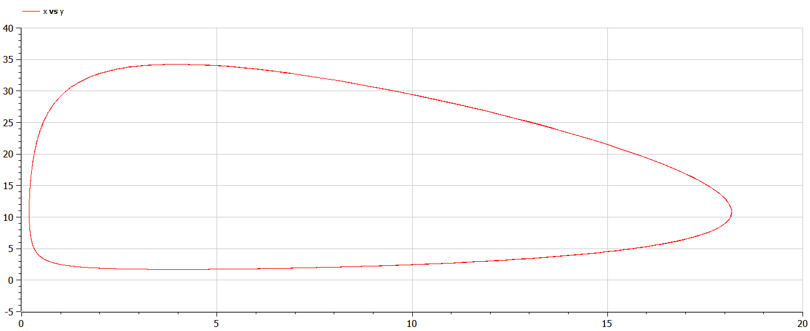
:::
::::::::::::::

## Стационарное состояние - Julia 

:::::::::::::: {.columns align=center}
::: {.column width="50%"}

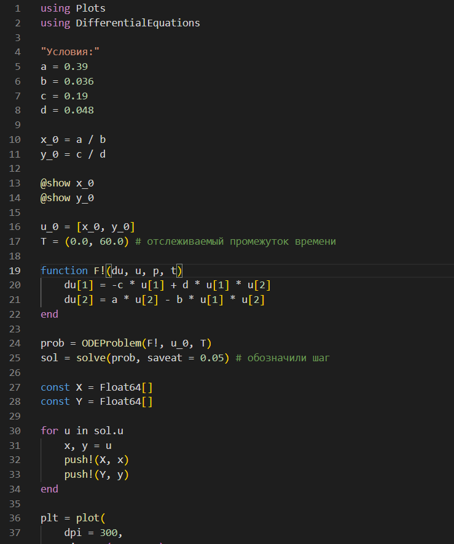

:::
::: {.column width="50%"}

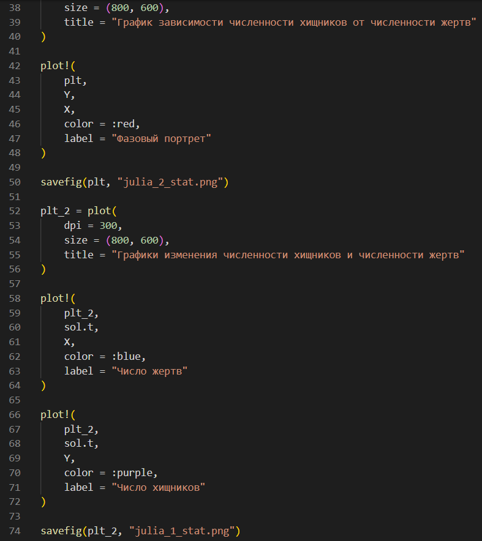
:::
::::::::::::::

## Стационарное состояние - Julia 

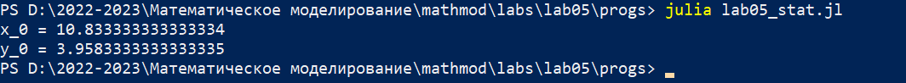

## Стационарное состояние - Julia - графики

:::::::::::::: {.columns align=center}
::: {.column width="50%"}

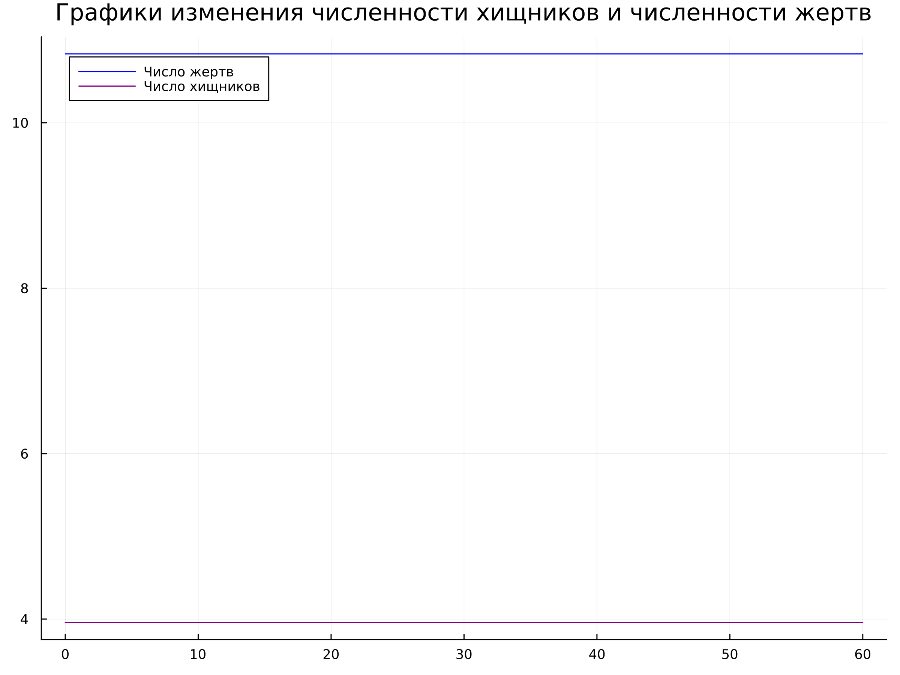

:::
::: {.column width="50%"}

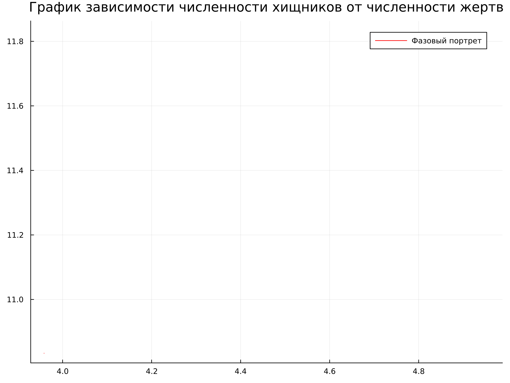
:::
::::::::::::::

# Результаты работы

- Построила график зависимости численности хищников от численности жертв
- Построила графики изменения численности хищников и численности жертв при заданных начальных условиях
- Нашла стационарное состояние системы

# Вывод

Создала простейшую модель взаимодействия двух видов типа «хищник — жертва» - модель Лотки-Вольтерры. Нашла стационарное состояние.

[def]: ttps://github.com/ovgubina