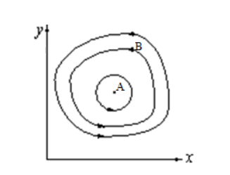
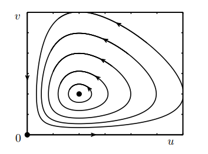
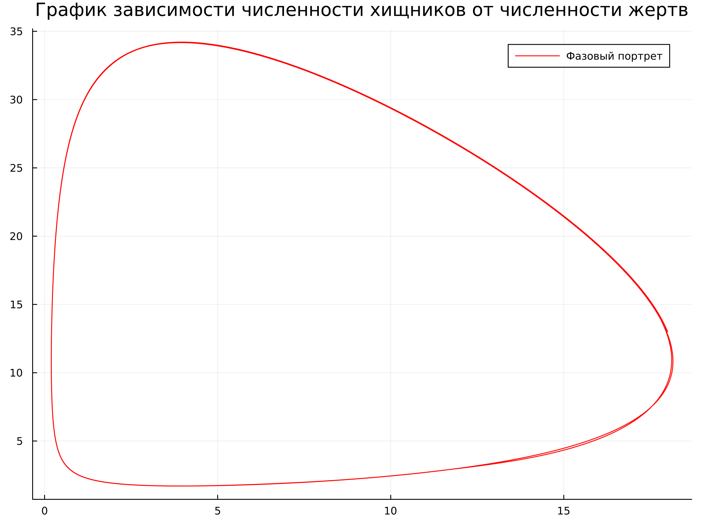
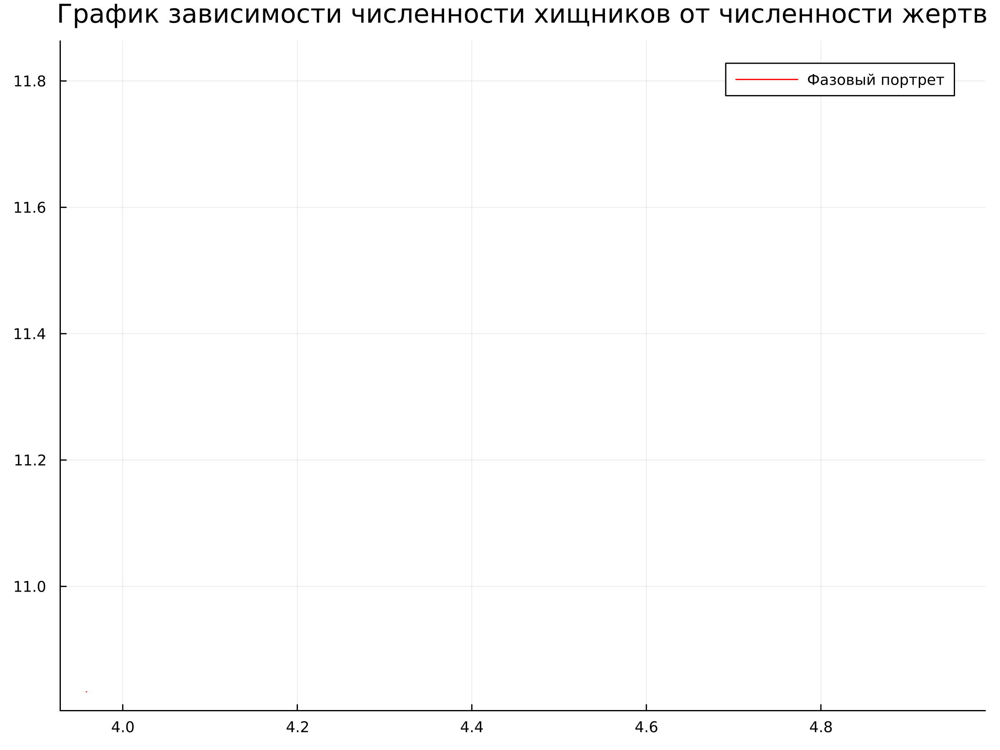

---
## Front matter
title: "Отчет по лабораторной работе №5"
subtitle: "Дисциплина: Математическое моделирование"
author: "Выполнила: Губина Ольга Вячеславовна"

## Generic otions
lang: ru-RU
toc-title: "Содержание"

## Bibliography
bibliography: bib/cite.bib
csl: pandoc/csl/gost-r-7-0-5-2008-numeric.csl

## Pdf output format
toc: true # Table of contents
toc-depth: 2
lof: true # List of figures
lot: true # List of tables
fontsize: 12pt
linestretch: 1.5
papersize: a4
documentclass: scrreprt
## I18n polyglossia
polyglossia-lang:
  name: russian
  options:
	- spelling=modern
	- babelshorthands=true
polyglossia-otherlangs:
  name: english
## I18n babel
babel-lang: russian
babel-otherlangs: english
## Fonts
mainfont: PT Serif
romanfont: PT Serif
sansfont: PT Sans
monofont: PT Mono
mainfontoptions: Ligatures=TeX
romanfontoptions: Ligatures=TeX
sansfontoptions: Ligatures=TeX,Scale=MatchLowercase
monofontoptions: Scale=MatchLowercase,Scale=0.9
## Biblatex
biblatex: true
biblio-style: "gost-numeric"
biblatexoptions:
  - parentracker=true
  - backend=biber
  - hyperref=auto
  - language=auto
  - autolang=other*
  - citestyle=gost-numeric
## Pandoc-crossref LaTeX customization
figureTitle: "Рис."
tableTitle: "Таблица"
listingTitle: "Листинг"
lofTitle: "Список иллюстраций"
lotTitle: "Список таблиц"
lolTitle: "Листинги"
## Misc options
indent: true
header-includes:
  - \usepackage{indentfirst}
  - \usepackage{float} # keep figures where there are in the text
  - \floatplacement{figure}{H} # keep figures where there are in the text
---

# Цель работы

Создать простейшую модель взаимодействия двух видов типа «хищник — жертва» - модель Лотки-Вольтерры.

# Задание

- Построить график зависимости численности хищников от численности жертв
- Построить графики изменения численности хищников и численности жертв при заданных начальных условиях
- Найти стационарное состояние системы 

# Теоретическое введение

Простейшая модель взаимодействия двух видов типа «хищник — жертва» -
**модель Лотки-Вольтерры**. Данная двувидовая модель основывается на
следующих предположениях:

- Численность популяции жертв x и хищников y зависят только от времени
(модель не учитывает пространственное распределение популяции на
занимаемой территории)
- В отсутствии взаимодействия численность видов изменяется по модели
Мальтуса, при этом число жертв увеличивается, а число хищников падает
- Естественная смертность жертвы и естественная рождаемость хищника
считаются несущественными
- Эффект насыщения численности обеих популяций не учитывается
- Скорость роста численности жертв уменьшается пропорционально
численности хищников (формула [-@eq:01])

$$
\begin{cases}
	\frac{dx}{dt} = ax(t) - bx(t)y(t)
	\\
	\frac{dy}{dt} = -cy(t) + dx(t)y(t)
\end{cases}
$$ {#eq:01}

В этой модели $x$ – число жертв, $y$ - число хищников. Коэффициент $a$
описывает скорость естественного прироста числа жертв в отсутствие хищников, $с$ - естественное вымирание хищников, лишенных пищи в виде жертв. Вероятность взаимодействия жертвы и хищника считается пропорциональной как количеству жертв, так и числу самих хищников $(xy)$. Каждый акт взаимодействия уменьшает популяцию жертв, но способствует увеличению популяции хищников (члены $-bxy$ и $dxy$ в правой части уравнения). 

{#fig:01 width=70%}

Математический анализ этой (жесткой) модели показывает, что имеется
стационарное состояние ($A$ на рис. [@fig:01]), всякое же другое начальное состояние ($B$) приводит к периодическому колебанию численности как жертв, так и хищников,
так что по прошествии некоторого времени система возвращается в состояние $B$.
Стационарное состояние системы [-@eq:01] (положение равновесия, не зависящее от времени решение) будет в точке: $x_0=\frac{c}{d}$, $y_0=\frac{a}{b}$. Если начальные значения
задать в стационарном состоянии $x(0)=x_0$, $y(0)=y_0$, то в любой момент времени численность популяций изменяться не будет. При малом отклонении от положения равновесия численности как хищника, так и жертвы с течением времени не возвращаются к равновесным значениям, а совершают периодические колебания вокруг стационарной точки. Амплитуда колебаний и их период определяется начальными значениями численностей $x(0)$, $y(0)$. Колебания совершаются в
противофазе.

При малом изменении модели

$$
\begin{cases}
	\frac{dx}{dt} = ax(t) - bx(t)y(t) + \varepsilon f(x,y)
	\\
	\frac{dy}{dt} = -cy(t) + dx(t)y(t) + \varepsilon g(x,y) , \varepsilon \ll 1
\end{cases}
$$

(прибавление к правым частям малые члены, учитывающие, например,
конкуренцию жертв за пищу и хищников за жертв), вывод о периодичности
(возвращении системы в исходное состояние $B$), справедливый для жесткой
системы Лотки-Вольтерры, теряет силу. Таким образом, мы получаем так
называемую мягкую модель «хищник-жертва». В зависимости от вида малых
поправок $f$ и $g$ возможны следующие сценарии 1-3 на рис. [@fig:02].

{#fig:02 width=70%}

**В случае 1** равновесное состояние A устойчиво. При любых других
начальных условиях через большое время устанавливается именно оно.

**В случае 2** система стационарное состояние неустойчиво. Эволюция
приводит то к резкому увеличению числа хищников, то к их почти полному
вымиранию. Такая система в конце концов попадает в область столь больших или
столь малых значений x и y, что модель перестает быть применимой.

**В случае 3** в системе с неустойчивым стационарным состоянием A с
течением времени устанавливается периодический режим. В отличие от исходной
жесткой модели Лотки-Вольтерры, в этой модели установившийся периодический
режим не зависит от начального условия. Первоначально незначительное
отклонение от стационарного состояния A приводит не к малым колебаниям около
A, как в модели Лотки-Вольтерры, а к колебаниям вполне определенной (и не
зависящей от малости отклонения) амплитуды. Возможны и другие структурно
устойчивые сценарии (например, с несколькими периодическими режимами).

Вывод: *жесткую модель всегда надлежит исследовать на структурную
устойчивость полученных при ее изучении результатов по отношению к малым
изменениям модели (делающим ее мягкой).*

В случае модели Лотки-Вольтерры для суждения о том, какой же из
сценариев 1-3 (или иных возможных) реализуется в данной системе, совершенно
необходима дополнительная информация о системе (о виде малых поправок f и g в
нашей формуле). Математическая теория мягких моделей указывает, какую именно
информацию для этого нужно иметь. Без этой информации жесткая модель может
привести к качественно ошибочным предсказаниям. Доверять выводам, сделанным
на основании жесткой модели, можно лишь тогда, когда они подтверждаются
исследованием их структурной устойчивости[@lr].

Фазовые кривые формируются (фазовый поток) вокруг положения равновесия (стационарное состояние) (рис. [@fig:10])[@bratus]:

{#fig:10 width=70%}

# Выполнение лабораторной работы

1. К выполнению нам предлагается выполнить соответстующий номеру студенчесткого билета вариант: 1032201737 % 70 + 1 = 8

2. Задача предложенного варианта состоит в следующем:

Для модели «хищник-жертва»:

$$
\begin{cases}
	\frac{dx}{dt} = -0.19x(t) + 0.048x(t)y(t)
	\\
	\frac{dy}{dt} = 0.39y(t) - 0.036x(t)y(t)
\end{cases}
$$ {#eq:03}

Постройте график зависимости численности хищников от численности жертв (фазовый портрет[@faze]),
а также графики изменения численности хищников и численности жертв при
следующих начальных условиях: $x_0=13$, $y_0=18$. Найдите стационарное
состояние системы.

3. По коэффициентам видим, что в данном случае y - число жертв, x - число хищников. Тогда, из условия коэффициенты имеют следующие значения: $a = 0.39$, $b = 0.036$, $c = 0.19$, $d = 0.048$.

А уравнение имеет следующий вид:

$$
\begin{cases}
	\frac{dx}{dt} = -cx(t) + dx(t)y(t)
	\\
	\frac{dy}{dt} = ay(t) - bx(t)y(t)
\end{cases}
$$ {#eq:04}

4. На языке Julia напишем код моделирующий взаимосвязь между хищниками и жертвами:

```
using Plots
using DifferentialEquations

"Условия:"
x_0 = 13
y_0 = 18

u_0 = [x_0, y_0]
T = (0.0, 60.0) # отслеживаемый промежуток времени

a = 0.39
b = 0.036
c = 0.19
d = 0.048

function F!(du, u, p, t)
	du[1] = -c * u[1] + d * u[1] * u[2]
	du[2] = a * u[2] - b * u[1] * u[2]
end

prob = ODEProblem(F!, u_0, T)
sol = solve(prob, saveat = 0.05) # обозначили шаг

const X = Float64[]
const Y = Float64[]

for u in sol.u
	x, y = u
	push!(X, x)
	push!(Y, y)
end

plt = plot(
	dpi = 300,
	size = (800, 600),
	title = "График зависимости численности хищников от численности жертв"
)

plot!(
	plt,	
	Y,
    X,
	color = :red,
	label = "Фазовый портрет"
)

savefig(plt, "julia_2.png")

plt_2 = plot(
	dpi = 300,
	size = (800, 600),
	title = "Графики изменения численности хищников и численности жертв"
)

plot!(
	plt_2,
	sol.t,
	X,
	color = :blue,
	label = "Число жертв"
)

plot!(
	plt_2,
	sol.t,
	Y,
	color = :purple,
	label = "Число хищников"
)

savefig(plt_2, "julia_1.png")

```

В качестве результата у нас графики изменения численности хищников и жертв (рис. [@fig:03]-[@fig:04]):

{#fig:03 width=70%}

{#fig:04 width=70%}

4. Напишем код на OpenModelica:

```
model lab05
  constant Integer x_0 = 13;
  constant Integer y_0 = 18;
  constant Real a = 0.39;
  constant Real b = 0.036;
  constant Real c = 0.19;
  constant Real d = 0.048;
  Real x(start=x_0);
  Real y(start=y_0);
  Real t = time;
equation
  der(x) = -c*x+d*x*y;
  der(y) = a*y-b*x*y;
  annotation(experiment(StartTime = 0, StopTime = 60.0),
    Documentation);
end lab05;
```

В качестве результата у нас графики изменения численности хищников и жертв (рис. [@fig:05]-[@fig:06]):

{#fig:05 width=70%}

{#fig:06 width=70%}

5. Теперь найдем стационарное состояние по формуле: $x_0=\frac{a}{b}$, $y_0=\frac{c}{d}$

Код для нахождения состояния и проверки правильности его обнаружения напишем на Julia. В нем выведем полученные значения и посчитаем его начальным значением численности хищников и жертв.

```
using Plots
using DifferentialEquations

"Условия:"
a = 0.39
b = 0.036
c = 0.19
d = 0.048

x_0 = a / b
y_0 = c / d

@show x_0
@show y_0

u_0 = [x_0, y_0]
T = (0.0, 60.0) # отслеживаемый промежуток времени

function F!(du, u, p, t)
	du[1] = -c * u[1] + d * u[1] * u[2]
	du[2] = a * u[2] - b * u[1] * u[2]
end

prob = ODEProblem(F!, u_0, T)
sol = solve(prob, saveat = 0.05) # обозначили шаг

const X = Float64[]
const Y = Float64[]

for u in sol.u
	x, y = u
	push!(X, x)
	push!(Y, y)
end

plt = plot(
	dpi = 300,
	size = (800, 600),
	title = "График зависимости численности хищников от численности жертв"
)

plot!(
	plt,
	Y,
    X,
	color = :red,
	label = "Фазовый портрет"
)

savefig(plt, "julia_2_stat.png")

plt_2 = plot(
	dpi = 300,
	size = (800, 600),
	title = "Графики изменения численности хищников и численности жертв"
)

plot!(
	plt_2,
	sol.t,
	X,
	color = :blue,
	label = "Число жертв"
)

plot!(
	plt_2,
	sol.t,
	Y,
	color = :purple,
	label = "Число хищников"
)

savefig(plt_2, "julia_1_stat.png")
```

Значения стационарного состояния следующие (рис. [@fig:07]):

{#fig:07 width=70%}

Результаты получены следующие (рис. [@fig:08]-[@fig:09]):

{#fig:08 width=70%}

{#fig:09 width=70%}

Стационарное состояние найдено правильно, поскольку численность не изменяется (рис. [@fig:08]), а эволюция популяций стоит на месте - точка (рис. [@fig:09]).

# Выводы

Создала простейшую модель взаимодействия двух видов типа «хищник — жертва» - модель Лотки-Вольтерры. Нашла стационарное состояние.

# Список литературы{.unnumbered}

::: {#refs}
:::
