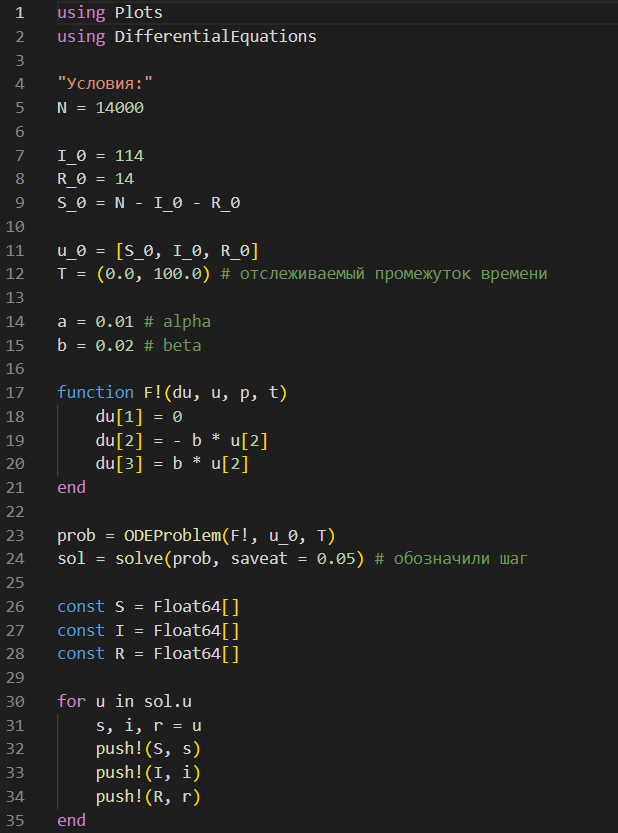
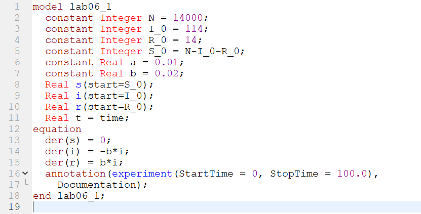
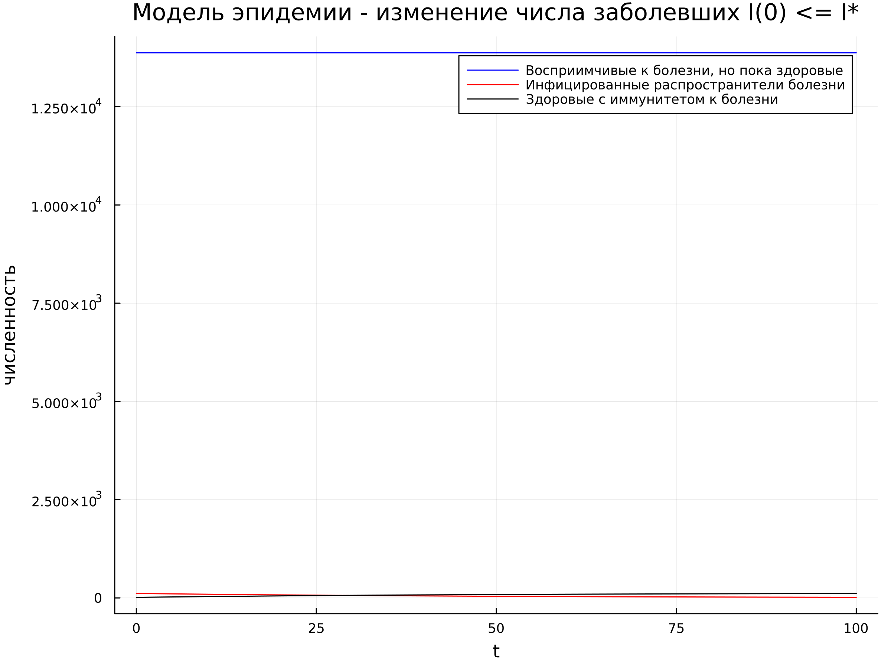
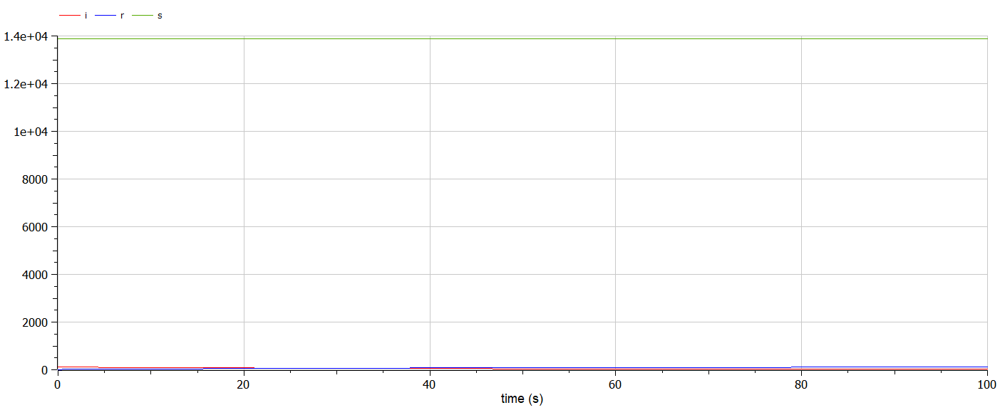
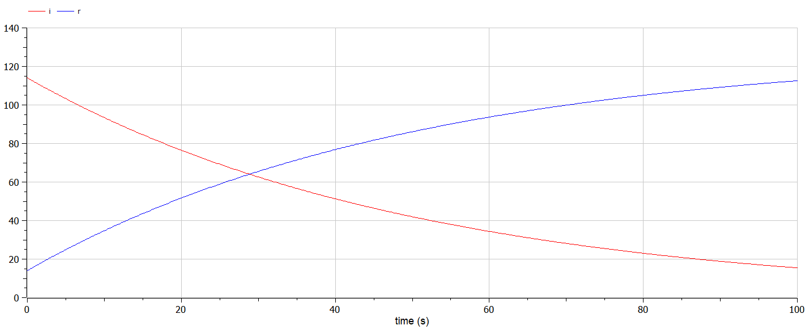
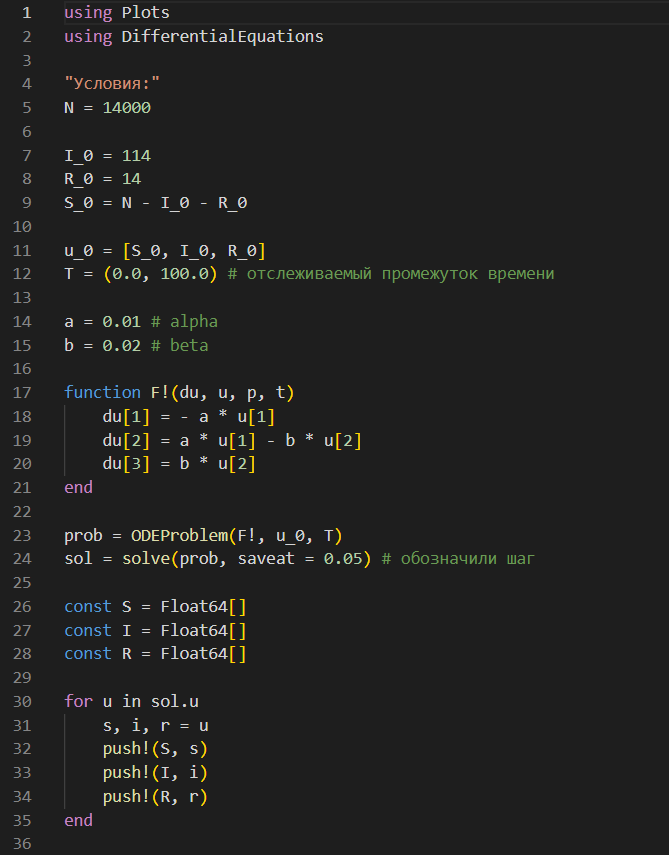
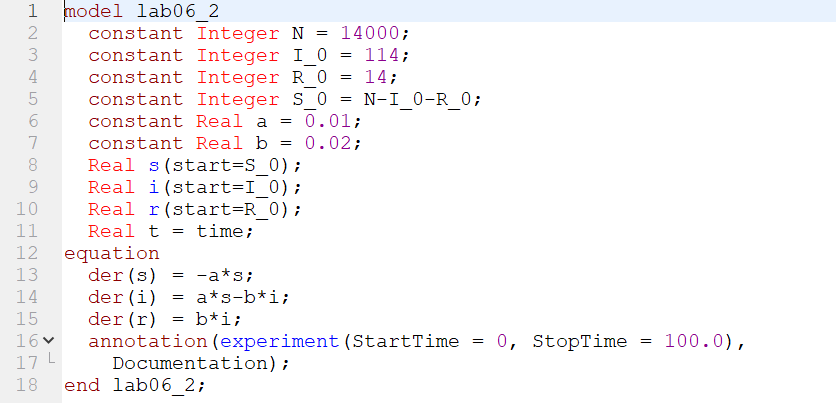
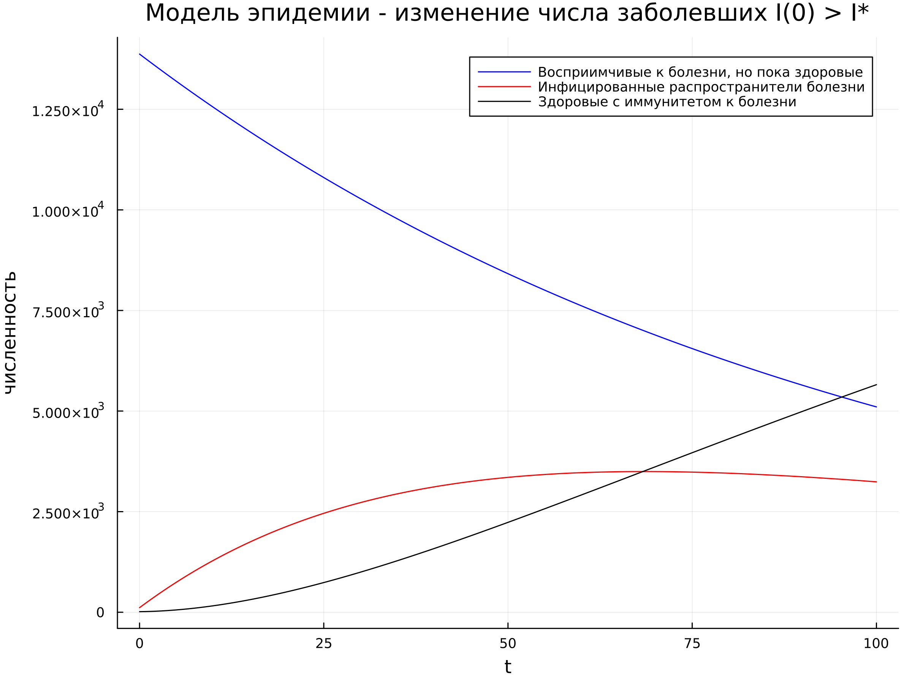
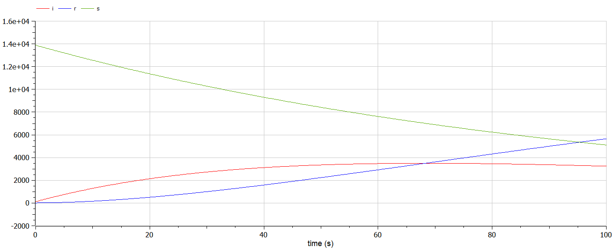

---
## Front matter
lang: ru-RU
title: Лабораторная работа №6
subtitle: Модель эпидемии
author:
  - Губина О. В.
institute:
  - Российский университет дружбы народов, Москва, Россия
date: 13 марта 2023

## i18n babel
babel-lang: russian
babel-otherlangs: english

## Formatting pdf
toc: false
toc-title: Содержание
slide_level: 2
aspectratio: 169
section-titles: true
theme: metropolis
header-includes:
 - \metroset{progressbar=frametitle,sectionpage=progressbar,numbering=fraction}
 - '\makeatletter'
 - '\beamer@ignorenonframefalse'
 - '\makeatother'
---

# Информация

## Докладчик

  * Губина Ольга Вячеславовна
  * студент(-ка) уч. группы НПИбд-01-20
  * Российский университет дружбы народов
  * [1032201737@pfur.ru](mailto:1032201737@rudn.ru)
  * <https://github.com/ovgubina>

# Вводная часть

## Актуальность

- Необходимость навыков моделирования реальных математических задач, построение графиков. 

## Объект и предмет исследования

- Простейшая модель эпидемии
- Языки для моделирования:
  - Julia
  - OpenModelica

## Цели и задачи

- Построить графики изменения числа особей в каждой из трех групп: восприимчивые к болезни, но пока здоровые особи - $S(t)$; инфицированные особи, которые также при этом являются распространителями инфекции - $I(t)$; $R(t)$ – здоровые особи с иммунитетом к болезни.

- Рассмотреть протекание эпидемия в двух различных случаях

## Материалы и методы

- Языки для моделирования:
  - Julia
  - OpenModelica

# Процесс выполнения работы

## Теория

$$
\frac{dS}{dt} = 
 \begin{cases}
   -\alpha S,\ если\ I(t) > I^* 
   \\
   0,\ если\ I(t) \le I^*
 \end{cases}
$$
$$
\frac{dI}{dt} = 
 \begin{cases}
   \alpha S - \beta I,\ если\ I(t) > I^* 
   \\
   -\beta I,\ если\ I(t) \le I^*
 \end{cases}
$$
$$
\frac{dR}{dt} = \beta I
$$

## Условие задачи

На одном острове вспыхнула эпидемия. Известно, что из всех проживающих
на острове ($N=14 000$) в момент начала эпидемии ($t=0$) число заболевших людей
(являющихся распространителями инфекции) $I(0)=114$, а число здоровых людей с иммунитетом к болезни $R(0)=14$. Таким образом, число людей восприимчивых к болезни, но пока здоровых, в начальный момент времени $S(0)=N-I(0)- R(0)$.

Постройте графики изменения числа особей в каждой из трех групп.
Рассмотрите, как будет протекать эпидемия в случае:

- если $I(t) \le I^*$

- если $I(t) > I^*$

## Первый случай $I(t) \le I^*$ - код на Julia

{width=40%}

## Первый случай $I(t) \le I^*$ - код на OpenModelica

{width=80%}

## Первый случай $I(t) \le I^*$ - графики

:::::::::::::: {.columns align=center}
::: {.column width="50%"}

:::
::: {.column width="50%"}

:::
::::::::::::::

## Первый случай $I(t) \le I^*$ - графики

## Второй случай $I(t) > I^*$ - код на Julia

{width=40%}

## Второй случай $I(t) > I^*$ - код на OpenModelica

{width=80%}

## Второй случай $I(t) > I^*$ - графики

:::::::::::::: {.columns align=center}
::: {.column width="50%"}

:::
::: {.column width="50%"}

:::
::::::::::::::

# Результаты работы

- Построила графики изменения числа особей в каждой из трех групп задачи об эпидемии

- Рассмотрела протекание эпидемия в двух различных случаях

# Вывод

Смоделировала задачу об эпидемии по средством языков программирования Julia и OpenModelica

[def]: ttps://github.com/ovgubina