---
## Front matter
lang: ru-RU
title: Лабораторная работа №7
subtitle: Модель распространения рекламы
author:
  - Губина О. В.
institute:
  - Российский университет дружбы народов, Москва, Россия
date: 25 марта 2023

## i18n babel
babel-lang: russian
babel-otherlangs: english

## Formatting pdf
toc: false
toc-title: Содержание
slide_level: 2
aspectratio: 169
section-titles: true
theme: metropolis
header-includes:
 - \metroset{progressbar=frametitle,sectionpage=progressbar,numbering=fraction}
 - '\makeatletter'
 - '\beamer@ignorenonframefalse'
 - '\makeatother'
---

# Информация

## Докладчик

  * Губина Ольга Вячеславовна
  * студент(-ка) уч. группы НПИбд-01-20
  * Российский университет дружбы народов
  * [1032201737@pfur.ru](mailto:1032201737@rudn.ru)
  * <https://github.com/ovgubina>

# Вводная часть

## Актуальность

- Необходимость навыков моделирования реальных математических задач, построение графиков. 

## Объект и предмет исследования

- Простейшая модель распространения рекламы
- Языки для моделирования:
  - Julia
  - OpenModelica

## Цели и задачи

- Построить график распространения рекламы для трех случаев

- Для случая 2 определить в какой момент времени скорость распространения рекламы будет иметь максимальное значение

## Материалы и методы

- Языки для моделирования:
  - Julia
  - OpenModelica

# Процесс выполнения работы

## Теория

Математическая модель распространения рекламы описывается
уравнением:
$$
\frac{dn}{dt} = (\alpha _1(t)+\alpha _2(t)n(t))(N-n(t))
$$

При $\alpha _1(t) >> \alpha _2(t)$ получается модель типа модели Мальтуса, в обратном случае, при $\alpha _1(t) << \alpha _2(t)$
получаем уравнение логистической
кривой.

## Условие задачи

Постройте график распространения рекламы, математическая модель которой описывается
следующим уравнением:

 $$\frac{dn}{dt} = (0.64 + 0.00014n(t))(N - n(t))$$
 $$\frac{dn}{dt} = (0.000014 + 0.63n(t))(N - n(t))$$
 $$\frac{dn}{dt} = (0.7t + 0.4\cos{t}n(t))(N - n(t))$$

При этом объем аудитории $N = 810$, в начальный момент о товаре знает $11$ человек. Для
случая 2 определите в какой момент времени скорость распространения рекламы будет
иметь максимальное значение.

## Первый случай - Julia

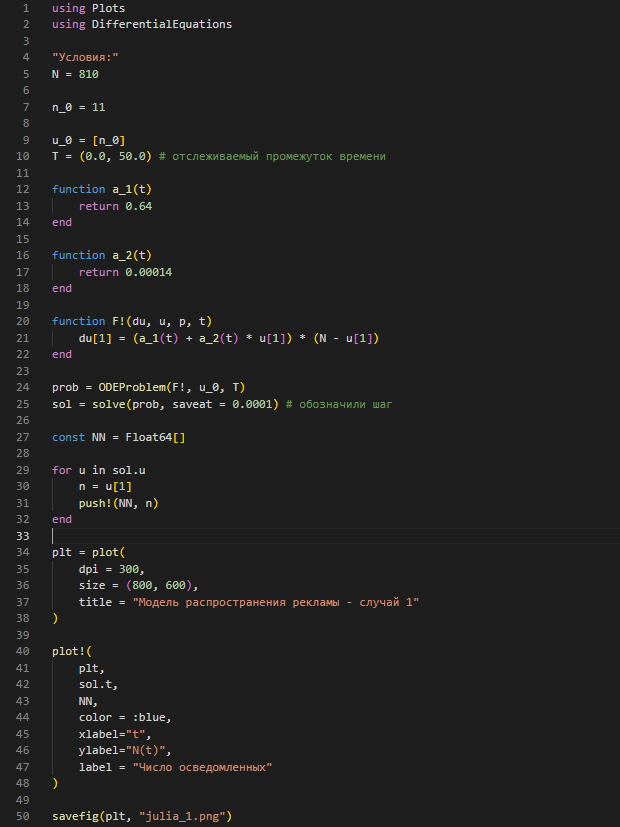{width=40%}

## Первый случай - код на OpenModelica

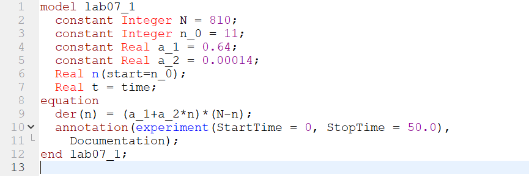{width=80%}

## Первый случай - графики

:::::::::::::: {.columns align=center}
::: {.column width="50%"}

:::
::: {.column width="50%"}

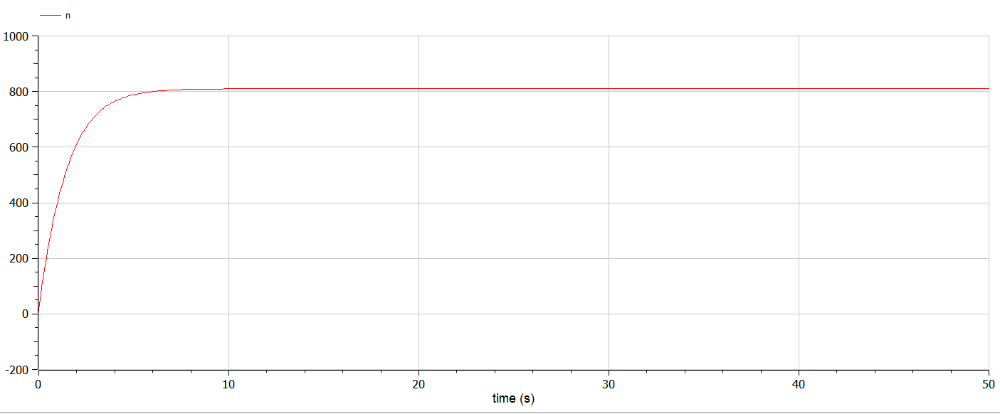
:::
::::::::::::::

## Второй случай - код на Julia

:::::::::::::: {.columns align=center}
::: {.column width="50%"}

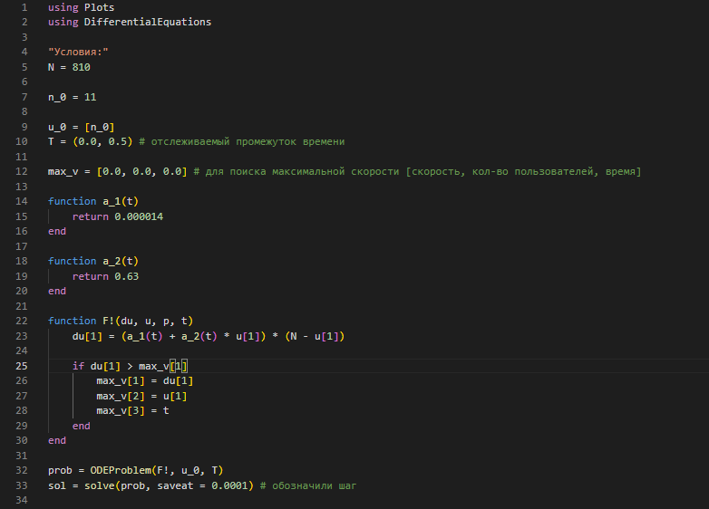

:::
::: {.column width="50%"}

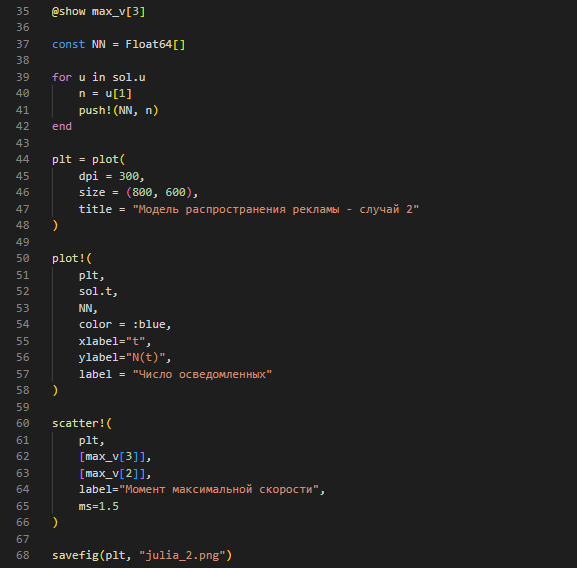
:::
::::::::::::::

## Второй случай - момент времени с максимальной скоростью распространения

{width=80%}

## Второй случай  - код на OpenModelica

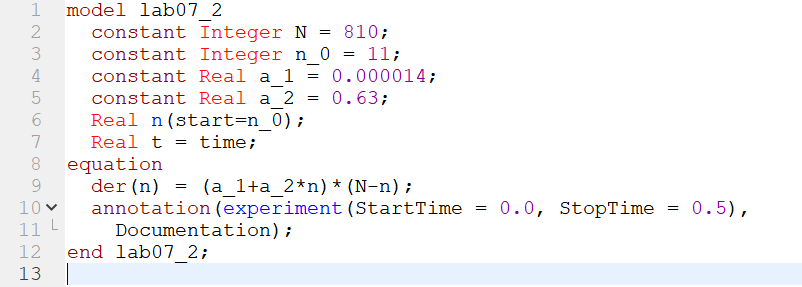{width=80%}

## Второй случай - графики

:::::::::::::: {.columns align=center}
::: {.column width="50%"}

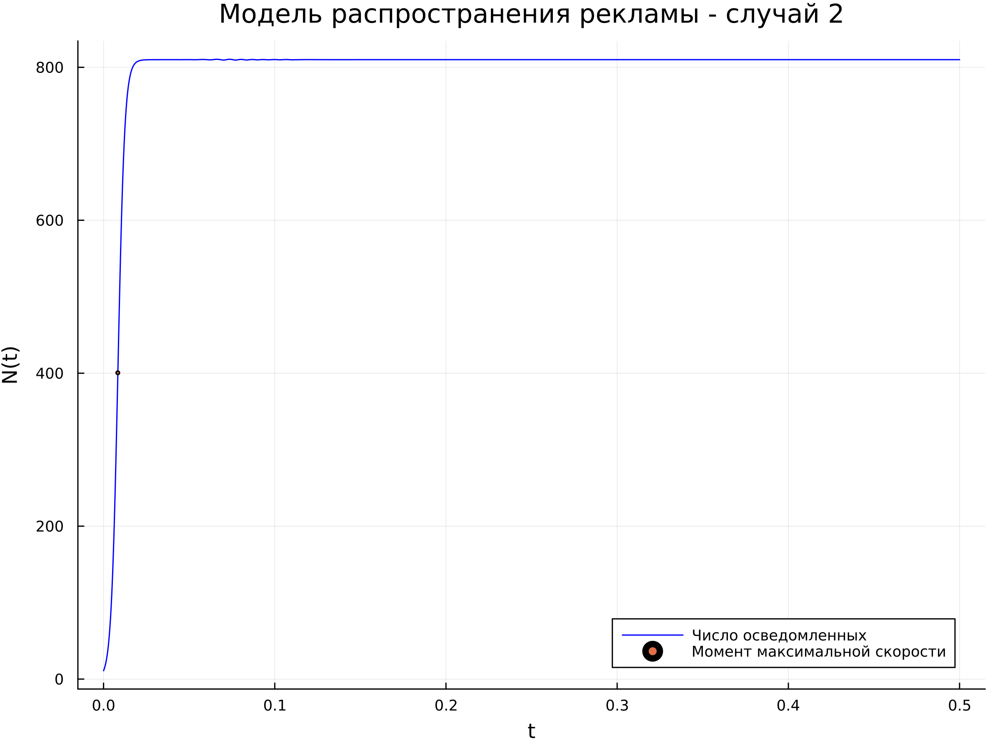

:::
::: {.column width="50%"}

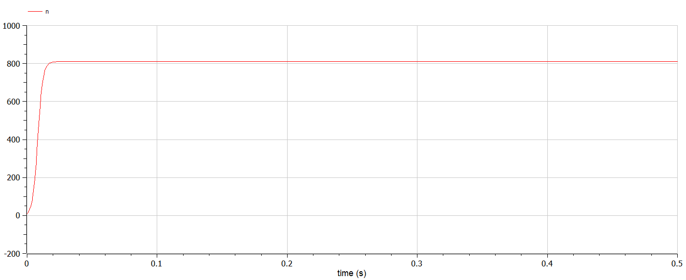
:::
::::::::::::::

## Третий случай - Julia

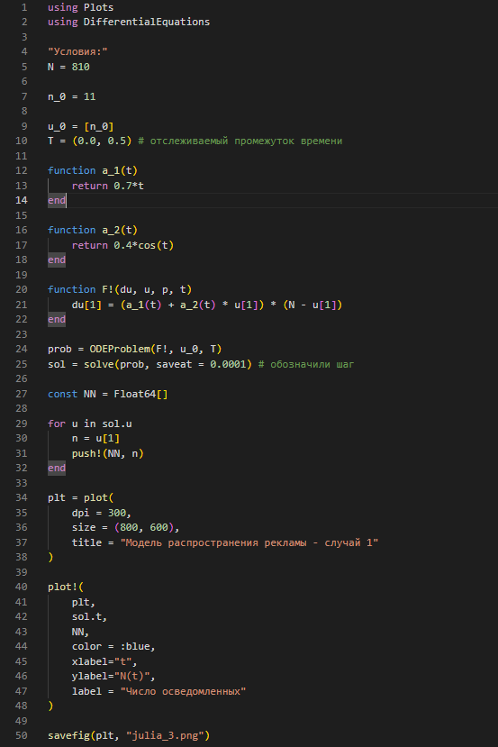{width=40%}

## Третий случай - код на OpenModelica

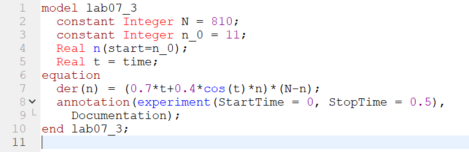{width=80%}

## Третий случай - графики

:::::::::::::: {.columns align=center}
::: {.column width="50%"}

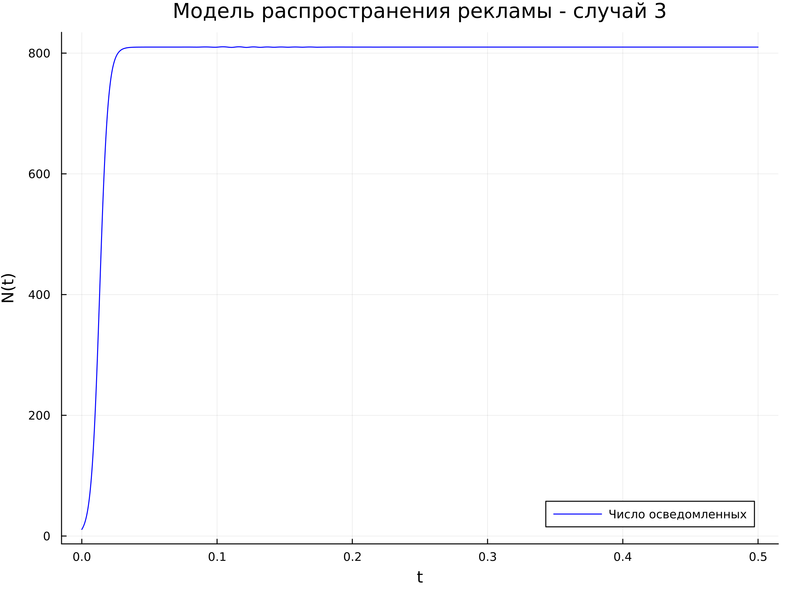

:::
::: {.column width="50%"}

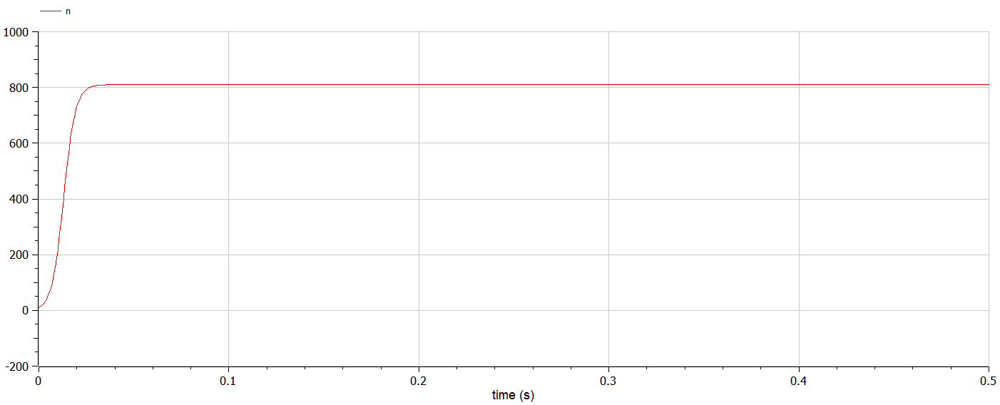
:::
::::::::::::::

# Результаты работы

- Построила график распространения рекламы для трех случаев

- Для случая 2 определила в какой момент времени скорость распространения рекламы будет иметь максимальное значение

# Вывод

Смоделировала распространение рекламы по средством языков программирования Julia и OpenModelica.

[def]: ttps://github.com/ovgubina