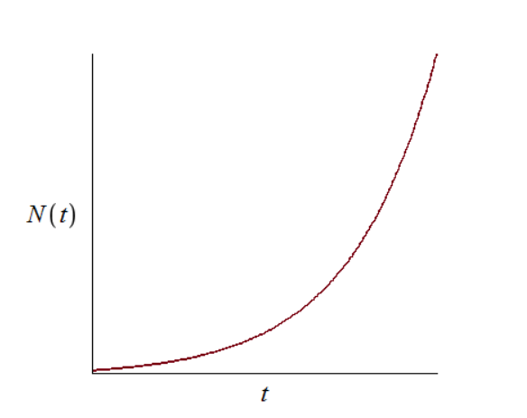

---
## Front matter
title: "Отчет по лабораторной работе №7"
subtitle: "Дисциплина: Математическое моделирование"
author: "Выполнила: Губина Ольга Вячеславовна"

## Generic otions
lang: ru-RU
toc-title: "Содержание"

## Bibliography
bibliography: bib/cite.bib
csl: pandoc/csl/gost-r-7-0-5-2008-numeric.csl

## Pdf output format
toc: true # Table of contents
toc-depth: 2
lof: true # List of figures
lot: true # List of tables
fontsize: 12pt
linestretch: 1.5
papersize: a4
documentclass: scrreprt
## I18n polyglossia
polyglossia-lang:
  name: russian
  options:
	- spelling=modern
	- babelshorthands=true
polyglossia-otherlangs:
  name: english
## I18n babel
babel-lang: russian
babel-otherlangs: english
## Fonts
mainfont: PT Serif
romanfont: PT Serif
sansfont: PT Sans
monofont: PT Mono
mainfontoptions: Ligatures=TeX
romanfontoptions: Ligatures=TeX
sansfontoptions: Ligatures=TeX,Scale=MatchLowercase
monofontoptions: Scale=MatchLowercase,Scale=0.9
## Biblatex
biblatex: true
biblio-style: "gost-numeric"
biblatexoptions:
  - parentracker=true
  - backend=biber
  - hyperref=auto
  - language=auto
  - autolang=other*
  - citestyle=gost-numeric
## Pandoc-crossref LaTeX customization
figureTitle: "Рис."
tableTitle: "Таблица"
listingTitle: "Листинг"
lofTitle: "Список иллюстраций"
lotTitle: "Список таблиц"
lolTitle: "Листинги"
## Misc options
indent: true
header-includes:
  - \usepackage{indentfirst}
  - \usepackage{float} # keep figures where there are in the text
  - \floatplacement{figure}{H} # keep figures where there are in the text
---

# Цель работы

Смоделировать распространение рекламы по средством языков программирования Julia и OpenModelica.

# Задание

- Постройте график распространения рекламы для трех случаев

- Для случая 2 определите в какой момент времени скорость распространения рекламы будет иметь максимальное значение

# Теоретическое введение

Модель рекламной кампании описывается следующими величинами.
Считаем, что $\frac{dn}{dt}$ - скорость изменения со временем числа потребителей,
узнавших о товаре и готовых его купить,
$t$ - время, прошедшее с начала рекламной
кампании, $n(t)$ - число уже информированных клиентов. Эта величина
пропорциональна числу покупателей, еще не знающих о нем, это описывается
следующим образом: $\alpha _1(t)(N-n(t))$, где
$N$ - общее число потенциальных платежеспособных покупателей, $\alpha _1(t)>0$ - характеризует интенсивность
рекламной кампании (зависит от затрат на рекламу в данный момент времени).
Помимо этого, узнавшие о товаре потребители также распространяют полученную
информацию среди потенциальных покупателей, не знающих о нем (в этом случае
работает т.н. сарафанное радио). Этот вклад в рекламу описывается величиной $\alpha _2(t)n(t)(N-n(t))$, эта величина увеличивается с увеличением потребителей
узнавших о товаре. Математическая модель распространения рекламы описывается
уравнением (формула [-@eq:01])[@rudn]:

$$
\frac{dn}{dt} = (\alpha _1(t)+\alpha _2(t)n(t))(N-n(t))
$$ {#eq:01}

При $\alpha _1(t) >> \alpha _2(t)$ получается модель типа модели Мальтуса (также именуется как мальтузианская модель - экспоненциальный рост с постоянным темпом [@maltus]), решение которой
имеет вид (рис. [@fig:01])

{#fig:01 width=70%}

В обратном случае, при $\alpha _1(t) << \alpha _2(t)$
получаем уравнение логистической
кривой (кривая, показывающая поведение с течением времени переменной $х$, где $a<x<b$, и увеличение $x$ задается формулой $\frac{dx}{dt}=\alpha (x-a)(b–x)$ [@log]) (рис. [@fig:02]):

{#fig:02 width=70%}


# Выполнение лабораторной работы

1. К выполнению нам предлагается выполнить соответстующий номеру студенчесткого билета вариант: 1032201737 % 70 + 1 = 8

2. Задача предложенного варианта состоит в следующем:

Постройте график распространения рекламы, математическая модель которой описывается
следующим уравнением:

$$
 \frac{dn}{dt} = (0.64 + 0.00014n(t))(N - n(t))
$$

$$
\frac{dn}{dt} = (0.000014 + 0.63n(t))(N - n(t))$$

$$
\frac{dn}{dt} = (0.7t + 0.4\cos{t}n(t))(N - n(t))
$$

При этом объем аудитории $N = 810$, в начальный момент о товаре знает $11$ человек. Для
случая 2 определите в какой момент времени скорость распространения рекламы будет
иметь максимальное значение.

## Первый случай 

1. Для первого случая распространение рекламы описывается следующим уравнением: 

$$
\frac{dn}{dt} = (0.64 + 0.00014n(t))(N - n(t))
$$ {#eq:02}

Отсюда видно, что:

$$
\alpha _1(t) = 0.64
$$

$$
\alpha _2(t) = 0.00014
$$

Это значит, что $$\alpha _1(t) >> \alpha _2(t)$$, значит, должна получиться модель типа Мальтуса.

На языке Julia напишем код моделирующий распространение рекламы:

```
using Plots
using DifferentialEquations

"Условия:"
N = 810

n_0 = 11

u_0 = [n_0]
T = (0.0, 50.0) # отслеживаемый промежуток времени

function a_1(t)
	return 0.64
end

function a_2(t)
	return 0.00014
end

function F!(du, u, p, t)
	du[1] = (a_1(t) + a_2(t) * u[1]) * (N - u[1])
end

prob = ODEProblem(F!, u_0, T)
sol = solve(prob, saveat = 0.0001) # обозначили шаг

const NN = Float64[]

for u in sol.u
	n = u[1]
	push!(NN, n)
end

plt = plot(
	dpi = 300,
	size = (800, 600),
	title = "Модель распространения рекламы - случай 1"
)

plot!(
	plt,
	sol.t,
	NN,
	color = :blue,
	xlabel="t",
	ylabel="N(t)",
	label = "Число осведомленных"
)

savefig(plt, "julia_1.png")
```

В качестве результата у нас график распространения рекламы (рис. [@fig:03]):

{#fig:03 width=70%}

2. Напишем код на OpenModelica:

```
model lab07_1
  constant Integer N = 810;
  constant Integer n_0 = 11;
  constant Real a_1 = 0.64;
  constant Real a_2 = 0.00014;
  Real n(start=n_0);
  Real t = time;
equation
  der(n) = (a_1+a_2*n)*(N-n);
  annotation(experiment(StartTime = 0, StopTime = 50.0),
    Documentation);
end lab07_1;
```

В качестве результата у нас график изменения численности численности заболеваемости (рис. [@fig:04]):

{#fig:04 width=70%}

## Второй случай 

1. Для второго случая распространение рекламы описывается следующим уравнением: 

$$
\frac{dn}{dt} = (0.000014 + 0.63n(t))(N - n(t))
$$ {#eq:03}

Отсюда видно, что:

- $$\alpha _1(t) = 0.000014$$

- $$\alpha _2(t) = 0.63$$

Это значит, что $$\alpha _1(t) << \alpha _2(t)$$, а значит, график будет иметь вид логистической кривой.

Также найдем точку, в которой скорость распространения рекламы будет максимальной.

На языке Julia напишем код моделирующий распространение рекламы:

```
using Plots
using DifferentialEquations

"Условия:"
N = 810

n_0 = 11

u_0 = [n_0]
T = (0.0, 0.5) # отслеживаемый промежуток времени

max_v = [0.0, 0.0, 0.0] # для поиска максимальной скорости [скорость, кол-во пользователей, время]

function a_1(t)
	return 0.000014
end

function a_2(t)
	return 0.63
end

function F!(du, u, p, t)
	du[1] = (a_1(t) + a_2(t) * u[1]) * (N - u[1])

	if du[1] > max_v[1]
		max_v[1] = du[1]
		max_v[2] = u[1]
		max_v[3] = t
	end
end

prob = ODEProblem(F!, u_0, T)
sol = solve(prob, saveat = 0.0001) # обозначили шаг

@show max_v[3]

const NN = Float64[]

for u in sol.u
	n = u[1]
	push!(NN, n)
end

plt = plot(
	dpi = 300,
	size = (800, 600),
	title = "Модель распространения рекламы - случай 2"
)

plot!(
	plt,
	sol.t,
	NN,
	color = :blue,
	xlabel="t",
	ylabel="N(t)",
	label = "Число осведомленных"
)

scatter!(
    plt,
    [max_v[3]],
    [max_v[2]],
    label="Момент максимальной скорости",
    ms=1.5
)

savefig(plt, "julia_2.png")
```

В качестве результата у нас график распространения рекламы (рис. [@fig:05]):

{#fig:05 width=70%}

Момент времени максимальной скорости распространения (рис. [@fig:06]):

{#fig:06 width=70%}

2. Напишем код на OpenModelica:

```
model lab07_2
  constant Integer N = 810;
  constant Integer n_0 = 11;
  constant Real a_1 = 0.000014;
  constant Real a_2 = 0.63;
  Real n(start=n_0);
  Real t = time;
equation
  der(n) = (a_1+a_2*n)*(N-n);
  annotation(experiment(StartTime = 0.0, StopTime = 0.5),
    Documentation);
end lab07_2;
```

В качестве результата у нас график изменения численности численности заболеваемости (рис. [@fig:07]):

{#fig:07 width=70%}

## Треий случай

1. Для первого случая распространение рекламы описывается следующим уравнением: 

$$
\frac{dn}{dt} = (0.7t + 0.4\cos{t}n(t))(N - n(t))
$$ {#eq:04}

Отсюда видно, что:

- $$\alpha _1(t) = 0.7t$$

- $$\alpha _2(t) = 0.4\cos{t}$$

На языке Julia напишем код моделирующий распространение рекламы:

```
using Plots
using DifferentialEquations

"Условия:"
N = 810

n_0 = 11

u_0 = [n_0]
T = (0.0, 0.5) # отслеживаемый промежуток времени

function a_1(t)
	return 0.7*t
end

function a_2(t)
	return 0.4*cos(t)
end

function F!(du, u, p, t)
	du[1] = (a_1(t) + a_2(t) * u[1]) * (N - u[1])
end

prob = ODEProblem(F!, u_0, T)
sol = solve(prob, saveat = 0.0001) # обозначили шаг

const NN = Float64[]

for u in sol.u
	n = u[1]
	push!(NN, n)
end

plt = plot(
	dpi = 300,
	size = (800, 600),
	title = "Модель распространения рекламы - случай 1"
)

plot!(
	plt,
	sol.t,
	NN,
	color = :blue,
	xlabel="t",
	ylabel="N(t)",
	label = "Число осведомленных"
)

savefig(plt, "julia_3.png")

```

В качестве результата у нас график распространения рекламы (рис. [@fig:08]):

{#fig:08 width=70%}

2. Напишем код на OpenModelica:

```
model lab07_3
  constant Integer N = 810;
  constant Integer n_0 = 11;
  Real n(start=n_0);
  Real t = time;
equation
  der(n) = (0.7*t+0.4*cos(t)*n)*(N-n);
  annotation(experiment(StartTime = 0, StopTime = 0.5),
    Documentation);
end lab07_3;
```

В качестве результата у нас график изменения численности численности заболеваемости (рис. [@fig:09]):

{#fig:09 width=70%}

# Выводы

- Построила график распространения рекламы для трех случаев

- Для случая 2 определила в какой момент времени скорость распространения рекламы будет иметь максимальное значение

# Список литературы{.unnumbered}

::: {#refs}
:::
