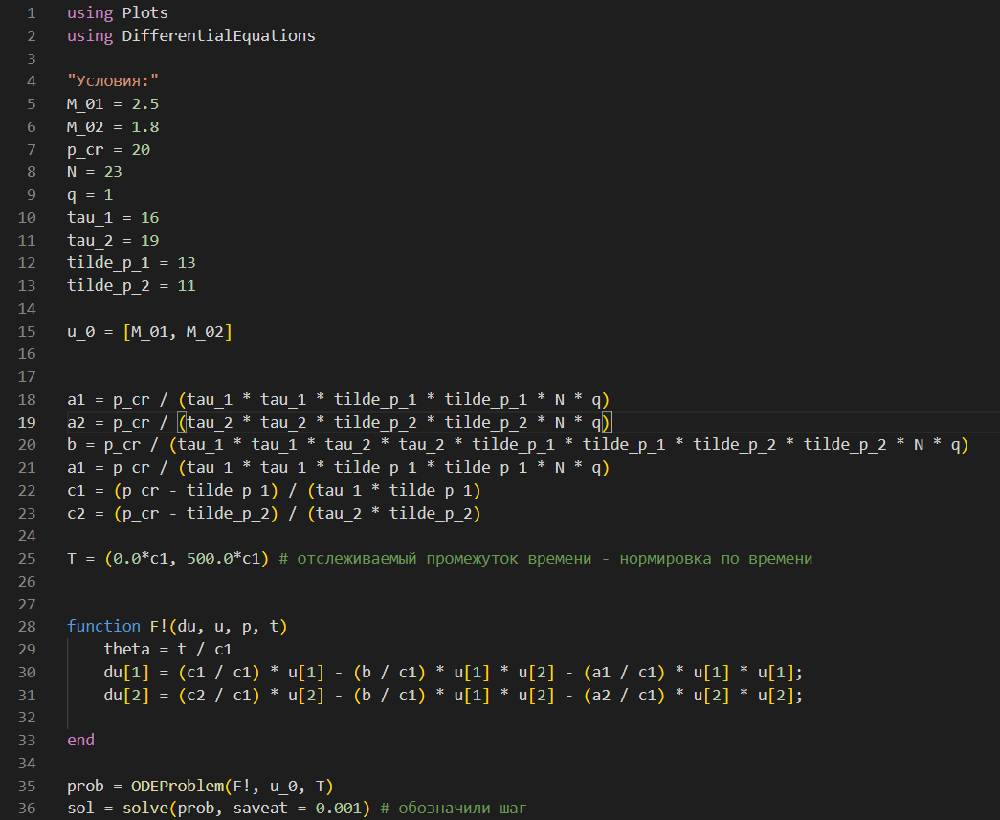
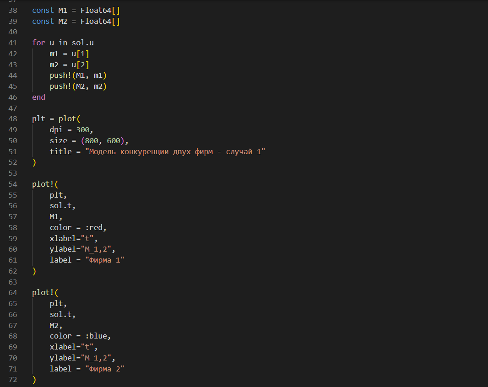
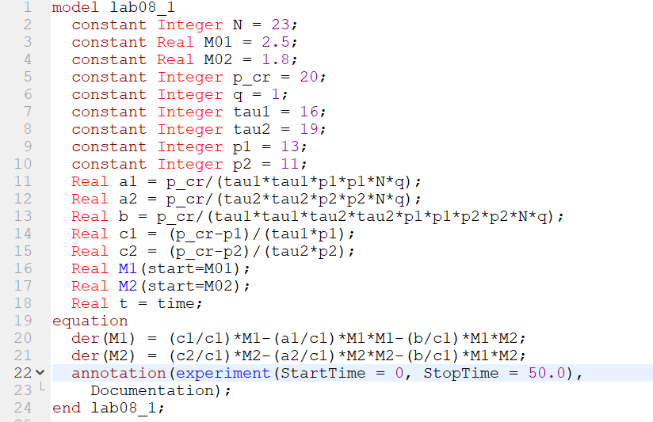
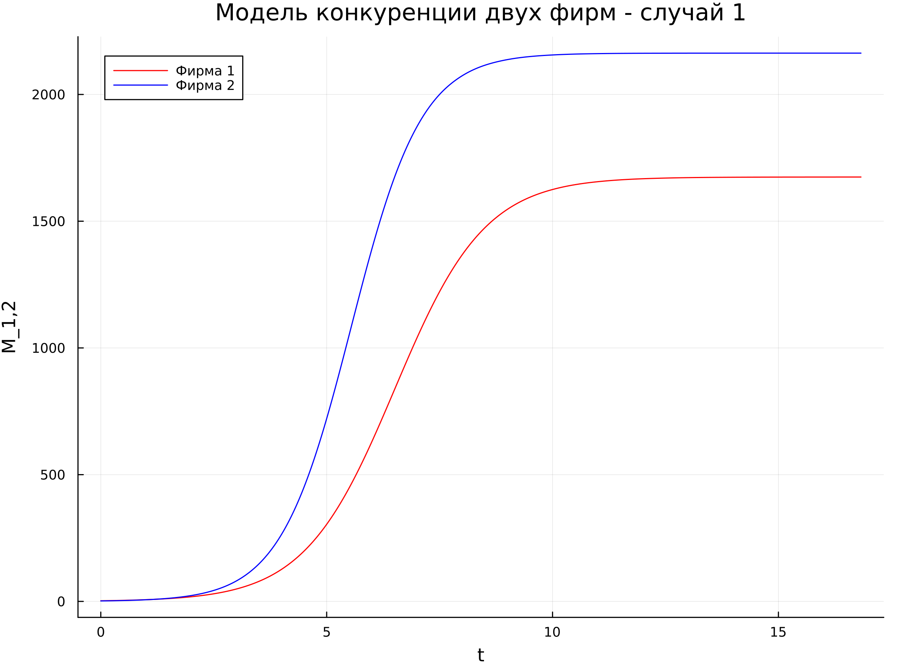
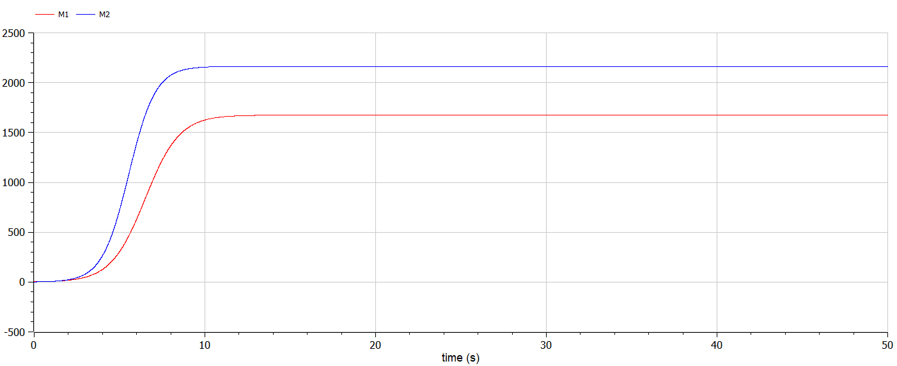
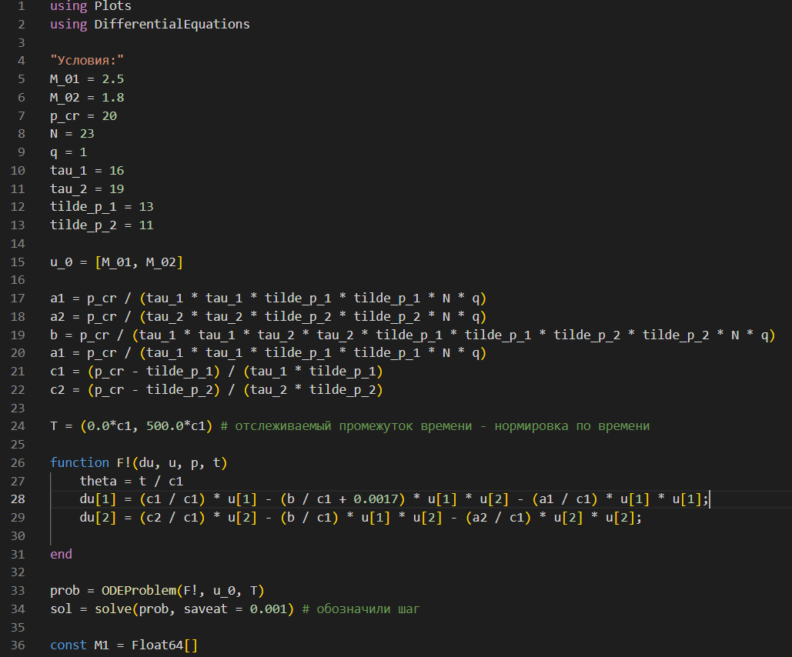
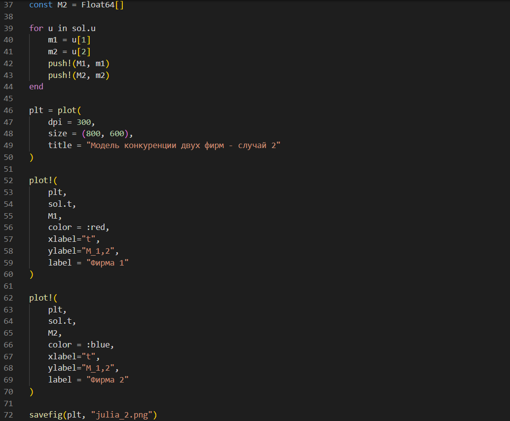
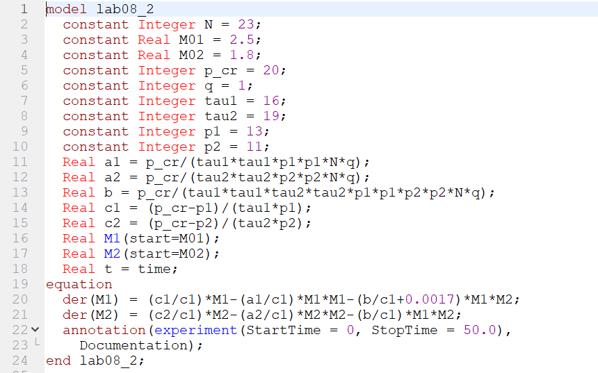
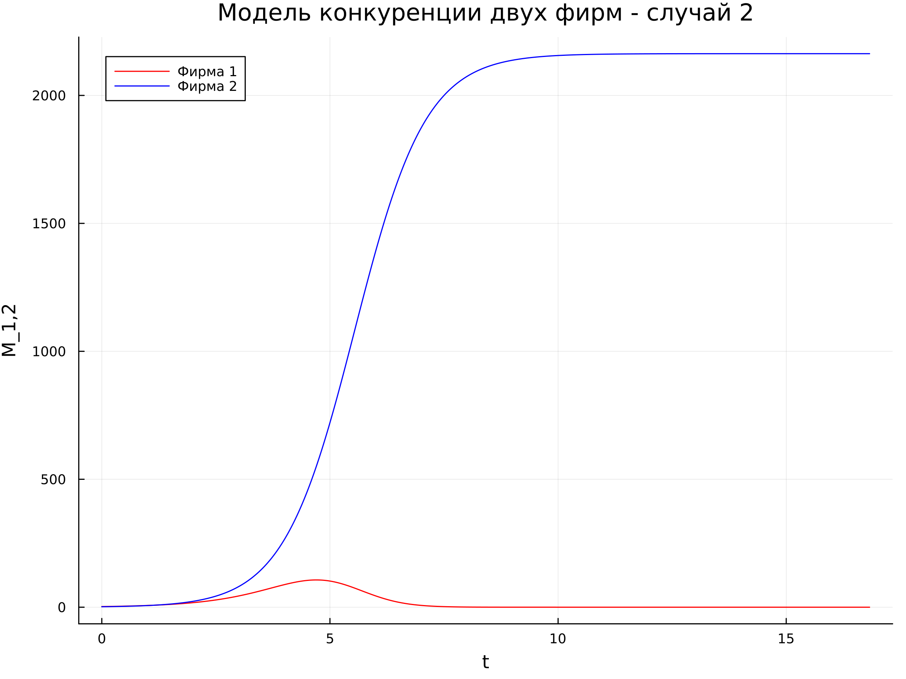
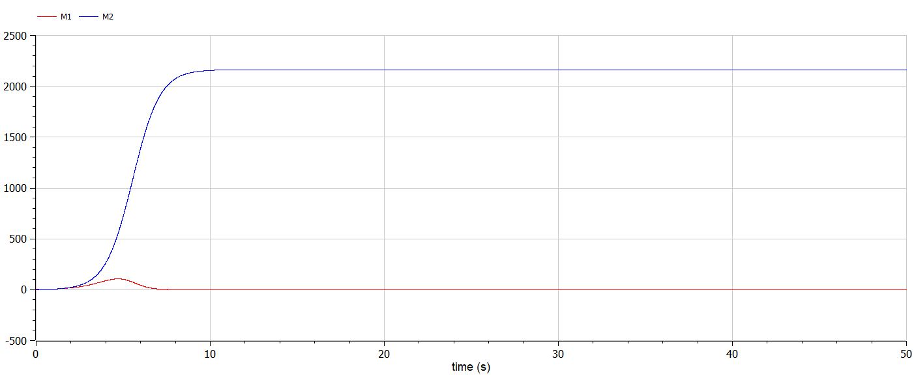

---
## Front matter
lang: ru-RU
title: Лабораторная работа №8
subtitle: Модель конуренции фирм
author:
  - Губина О. В.
institute:
  - Российский университет дружбы народов, Москва, Россия
date: 31 марта 2023

## i18n babel
babel-lang: russian
babel-otherlangs: english

## Formatting pdf
toc: false
toc-title: Содержание
slide_level: 2
aspectratio: 169
section-titles: true
theme: metropolis
header-includes:
 - \metroset{progressbar=frametitle,sectionpage=progressbar,numbering=fraction}
 - '\makeatletter'
 - '\beamer@ignorenonframefalse'
 - '\makeatother'
---

# Информация

## Докладчик

  * Губина Ольга Вячеславовна
  * студент(-ка) уч. группы НПИбд-01-20
  * Российский университет дружбы народов
  * [1032201737@pfur.ru](mailto:1032201737@rudn.ru)
  * <https://github.com/ovgubina>

# Вводная часть

## Актуальность

- Необходимость навыков моделирования реальных математических задач, построение графиков. 

## Объект и предмет исследования

- Простейшая модель конкурсенции двух фирм
- Языки для моделирования:
  - Julia
  - OpenModelica

## Цели и задачи

- Построить графики изменения оборотных средств фирмы 1 и фирмы 2 без учета постоянных издержек и с веденной нормировкой для двух случаев

## Материалы и методы

- Языки для моделирования:
  - Julia
  - OpenModelica

# Процесс выполнения работы

## Теория

Уравнения динамики оборотных средств:

$$
\frac{dM}{dt} = -\frac{M\delta}{\tau} + NQp - k = -\frac{M\delta}{\tau} + Nq\left(1-\frac{p}{p_{cr}}\right)p-k
$$

## Условие задачи

**Случай 1.** Рассмотрим две фирмы, производящие взаимозаменяемые товары
одинакового качества и находящиеся в одной рыночной нише. Считаем, что в рамках
нашей модели конкурентная борьба ведётся только рыночными методами. То есть,
конкуренты могут влиять на противника путем изменения параметров своего
производства: себестоимость, время цикла, но не могут прямо вмешиваться в
ситуацию на рынке («назначать» цену или влиять на потребителей каким-либо иным
способом.) Будем считать, что постоянные издержки пренебрежимо малы, и в
модели учитывать не будем. В этом случае динамика изменения объемов продаж
фирмы 1 и фирмы 2 описывается следующей системой уравнений:

$$
\begin{cases}
	\frac{dM_1}{d\theta} = M_1 - \frac{b}{c_1}M_1M_2 - \frac{a_1}{c_1}M^2_1
	\\
	\frac{dM_2}{d\theta} = \frac{c_2}{c_1}M_2 - \frac{b}{c_1}M_1M_2 - \frac{a_2}{c_1}M^2_2
\end{cases}
$$

## Начальные условия

$$
M^1_0=2.5,\ M^2_0=1.8,
$$
$$
p_{cr}=20,\ N = 23,\ q = 1,
$$
$$
\tau _1 = 16,\ \tau _2 = 19,
$$
$$
\tilde p_1 = 13, \tilde p_2 = 11
$$

## Первый случай - Julia

:::::::::::::: {.columns align=center}
::: {.column width="50%"}

:::
::: {.column width="50%"}

:::
::::::::::::::

## Первый случай - код на OpenModelica

{width=80%}

## Первый случай - графики

:::::::::::::: {.columns align=center}
::: {.column width="50%"}

:::
::: {.column width="50%"}

:::
::::::::::::::

## Условие задачи

**Случай 2.** Рассмотрим модель, когда, помимо экономического фактора влияния (изменение себестоимости, производственного цикла, использование
кредита и т.п.), используются еще и социально-психологические факторы –
формирование общественного предпочтения одного товара другому, не зависимо от
их качества и цены. В этом случае взаимодействие двух фирм будет зависеть друг
от друга, соответственно, коэффициент перед $M_1M_2$
будет отличаться. Пусть в
рамках рассматриваемой модели динамика изменения объемов продаж фирмы 1 и
фирмы 2 описывается следующей системой уравнений:

$$
\begin{cases}
	\frac{dM_1}{d\theta} = M_1 - \left(\frac{b}{c_1}+0.0017\right)M_1M_2 - \frac{a_1}{c_1}M^2_1
	\\
	\frac{dM_2}{d\theta} = \frac{c_2}{c_1}M_2 - \frac{b}{c_1}M_1M_2 - \frac{a_2}{c_1}M^2_2
\end{cases}
$$

## Второй случай - код на Julia

:::::::::::::: {.columns align=center}
::: {.column width="50%"}

:::
::: {.column width="50%"}

:::
::::::::::::::

## Второй случай  - код на OpenModelica

{width=80%}

## Второй случай - графики

:::::::::::::: {.columns align=center}
::: {.column width="50%"}

:::
::: {.column width="50%"}

:::
::::::::::::::

# Результаты работы

- Построила графики изменения оборотных средств фирмы 1 и фирмы 2 без учета постоянных издержек и с веденной нормировкой для двух случаев

# Вывод

Создала модель конкуренции двух фирм по средством языков программирования Julia и OpenModelica.

[def]: ttps://github.com/ovgubina