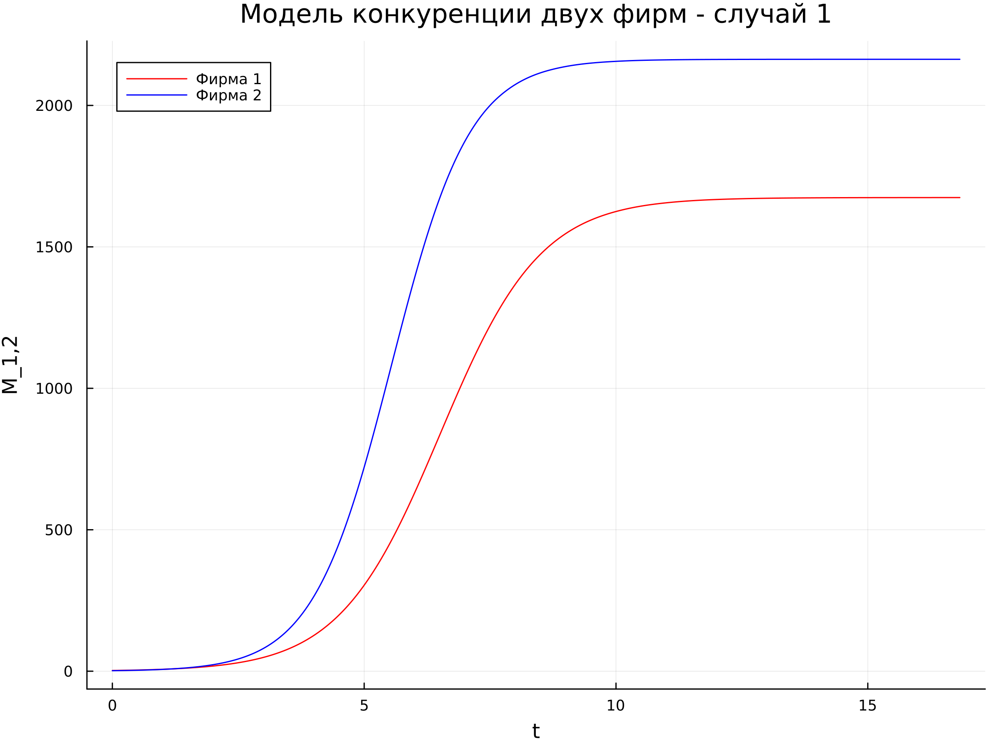
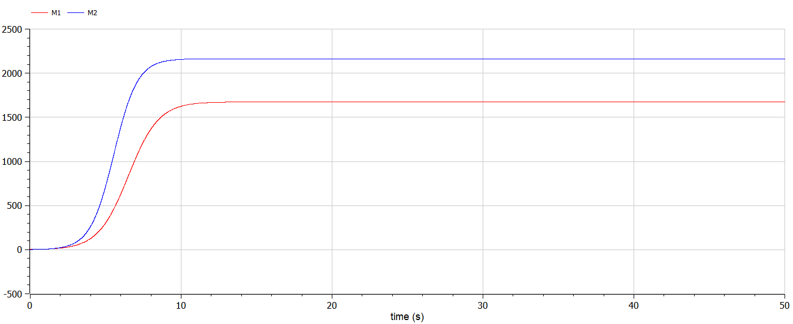
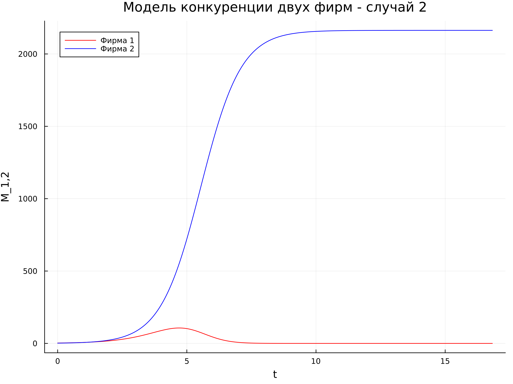
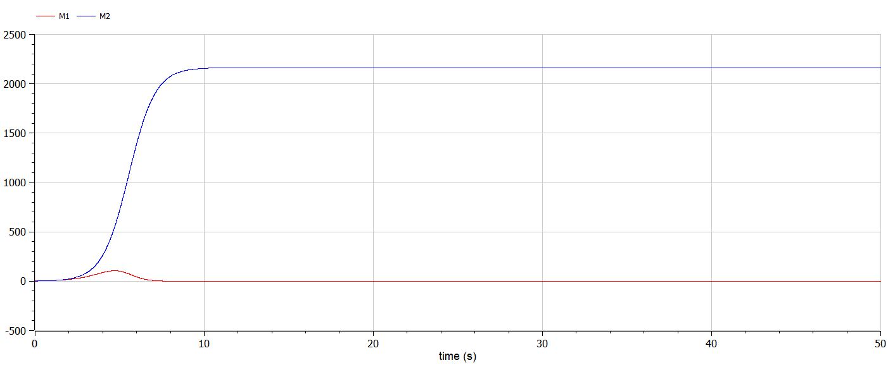

---
## Front matter
title: "Отчет по лабораторной работе №8"
subtitle: "Дисциплина: Математическое моделирование"
author: "Выполнила: Губина Ольга Вячеславовна"

## Generic otions
lang: ru-RU
toc-title: "Содержание"

## Bibliography
bibliography: bib/cite.bib
csl: pandoc/csl/gost-r-7-0-5-2008-numeric.csl

## Pdf output format
toc: true # Table of contents
toc-depth: 2
lof: true # List of figures
lot: true # List of tables
fontsize: 12pt
linestretch: 1.5
papersize: a4
documentclass: scrreprt
## I18n polyglossia
polyglossia-lang:
  name: russian
  options:
	- spelling=modern
	- babelshorthands=true
polyglossia-otherlangs:
  name: english
## I18n babel
babel-lang: russian
babel-otherlangs: english
## Fonts
mainfont: PT Serif
romanfont: PT Serif
sansfont: PT Sans
monofont: PT Mono
mainfontoptions: Ligatures=TeX
romanfontoptions: Ligatures=TeX
sansfontoptions: Ligatures=TeX,Scale=MatchLowercase
monofontoptions: Scale=MatchLowercase,Scale=0.9
## Biblatex
biblatex: true
biblio-style: "gost-numeric"
biblatexoptions:
  - parentracker=true
  - backend=biber
  - hyperref=auto
  - language=auto
  - autolang=other*
  - citestyle=gost-numeric
## Pandoc-crossref LaTeX customization
figureTitle: "Рис."
tableTitle: "Таблица"
listingTitle: "Листинг"
lofTitle: "Список иллюстраций"
lotTitle: "Список таблиц"
lolTitle: "Листинги"
## Misc options
indent: true
header-includes:
  - \usepackage{indentfirst}
  - \usepackage{float} # keep figures where there are in the text
  - \floatplacement{figure}{H} # keep figures where there are in the text
---

# Цель работы

Создать модель конкуренции двух фирм по средством языков программирования Julia и OpenModelica.

# Задание

- Построить графики изменения оборотных средств фирмы 1 и фирмы 2 без учета постоянных издержек и с веденной нормировкой для двух случаев

# Теоретическое введение

Математическому моделированию процессов конкуренции и сотрудничества двух фирм на различных рынках посвящено довольно много научных работ, в основном использующих аппарат теории игр и статистических решений. В качестве примера можно привести работы таких исследователей, как Курно, Стакельберг, Бертран, Нэш, Парето.
В данной работе авторы предприняли взглянуть на эту задачу с точки зрения экономической динамики.

Следует отметить, что динамические дифференциальные модели уже давно и успешно используются для математического моделирования самых разнообразных по своей природе процессов. Достаточно упомянуть широко использующуюся в экологии модель «хищник-жертва» Вольтера [@murray], математическую теорию развития эпидемий, модели боевых действий.В качестве классических примеров дифференциальных моделей экономической динамики отметим модель Эванса установления равновесной цены на рынке одного товара, односекторную модель экономического роста Солоу, однопродуктовые динамические макроэкономические модели Леонтьева.[@rae]

Для построения модели конкуренции хотя бы двух фирм необходимо
рассмотреть модель одной фирмы. Вначале рассмотрим модель фирмы,
производящей продукт долговременного пользования, когда цена его определяется
балансом спроса и предложения. Примем, что этот продукт занимает
определенную нишу рынка и конкуренты в ней отсутствуют.
Обозначим:

$N$ – число потребителей производимого продукта.

$S$ – доходы потребителей данного продукта. Считаем, что доходы всех
потребителей одинаковы. Это предположение справедливо, если речь идет об
одной рыночной нише, т.е. производимый продукт ориентирован на определенный
слой населения.

$M$ – оборотные средства предприятия.

$\tau$ – длительность производственного цикла.

$p$ – рыночная цена товара.

$\tilde p$ – себестоимость продукта, то есть переменные издержки на производство единицы продукции.

$\delta$ – доля оборотных средств, идущая на покрытие переменных издержек.

$k$ – постоянные издержки, которые не зависят от количества выпускаемой
продукции.

$Q(S/p)$ – функция спроса, зависящая от отношения дохода S к цене p. Она
равна количеству продукта, потребляемого одним потребителем в единицу
времени.

Функцию спроса товаров долговременного использования часто
представляют в простейшей форме:

$$
Q=q-k \frac{p}{S}=q\left(1-\frac{p}{p_{cr}}\right)
$$ {#eq:01}

где $q$ – максимальная потребность одного человека в продукте в единицу времени.

Эта функция падает с ростом цены и при $p = p_{cr}$ (критическая стоимость продукта) потребители отказываются от приобретения товара. Величина $p_{cr} = \frac{Sq}{k}$.

Параметр $k$ – мера эластичности функции спроса по цене. Таким образом, функция
спроса в форме ([-@eq:01]) является пороговой (то есть, $Q(S/p) = 0$ при $p \ge p_{cr}$) и обладает
свойствами насыщения.
Уравнения динамики оборотных средств можно записать в виде:

$$
\frac{dM}{dt} = -\frac{M\delta}{\tau} + NQp - k = -\frac{M\delta}{\tau} + Nq\left(1-\frac{p}{p_{cr}}\right)p-k
$$ {#eq:02}

Уравнение для рыночной цены p представим в виде:

$$
\frac{dp}{dt}=\gamma\left(-\frac{M\delta}{\tau\tilde p} + Nq\left(1-\frac{p}{p_{cr}}\right)\right)
$$ {#eq:03}

Первый член соответствует количеству поставляемого на рынок товара (то
есть, предложению), а второй член – спросу.[@rudn]


# Выполнение лабораторной работы

1. К выполнению нам предлагается выполнить соответстующий номеру студенчесткого билета вариант: 1032201737 % 70 + 1 = 8

2. Задача предложенного варианта состоит в следующем:

**Случай 1.** Рассмотрим две фирмы, производящие взаимозаменяемые товары
одинакового качества и находящиеся в одной рыночной нише. Считаем, что в рамках
нашей модели конкурентная борьба ведётся только рыночными методами. То есть,
конкуренты могут влиять на противника путем изменения параметров своего
производства: себестоимость, время цикла, но не могут прямо вмешиваться в
ситуацию на рынке («назначать» цену или влиять на потребителей каким-либо иным
способом.) Будем считать, что постоянные издержки пренебрежимо малы, и в
модели учитывать не будем. В этом случае динамика изменения объемов продаж
фирмы 1 и фирмы 2 описывается следующей системой уравнений:

$$
\begin{cases}
	\frac{dM_1}{d\theta} = M_1 - \frac{b}{c_1}M_1M_2 - \frac{a_1}{c_1}M^2_1
	\\
	\frac{dM_2}{d\theta} = \frac{c_2}{c_1}M_2 - \frac{b}{c_1}M_1M_2 - \frac{a_2}{c_1}M^2_2
\end{cases}
$$ {#eq:04}

где $a_1=\frac{p_{cr}}{\tau ^2_1\tilde p^2_1 Nq}$, $a_2=\frac{p_{cr}}{\tau ^2_2\tilde p^2_2 Nq}$, $b=\frac{p_{cr}}{\tau ^2_1\tilde p^2_1 \tau ^2_2\tilde p^2_2 Nq}$, $c_1=\frac{p_{cr}-\tilde p_1}{\tau _1 \tilde p_1}$, $c_2=\frac{p_{cr}-\tilde p_2}{\tau _2 \tilde p_2}$

Также введена нормировка $t = c_1 \theta$.

**Случай 2.** Рассмотрим модель, когда, помимо экономического фактора
влияния (изменение себестоимости, производственного цикла, использование
кредита и т.п.), используются еще и социально-психологические факторы –
формирование общественного предпочтения одного товара другому, не зависимо от
их качества и цены. В этом случае взаимодействие двух фирм будет зависеть друг
от друга, соответственно коэффициент перед $M_1M_2$
будет отличаться. Пусть в
рамках рассматриваемой модели динамика изменения объемов продаж фирмы 1 и
фирмы 2 описывается следующей системой уравнений:

$$
\begin{cases}
	\frac{dM_1}{d\theta} = M_1 - \left(\frac{b}{c_1}+0.0017\right)M_1M_2 - \frac{a_1}{c_1}M^2_1
	\\
	\frac{dM_2}{d\theta} = \frac{c_2}{c_1}M_2 - \frac{b}{c_1}M_1M_2 - \frac{a_2}{c_1}M^2_2
\end{cases}
$$ {#eq:05}

Для обоих случаев рассмотрим задачу со следующими начальными условиями и параметрами:

$$
M^1_0=2.5,\ M^2_0=1.8,
\\
p_{cr}=20,\ N = 23,\ q = 1,
\\
\tau _1 = 16,\ \tau _2 = 19,
\\
\tilde p_1 = 13, \tilde p_2 = 11
$$

**Замечание:** Значения $p_{cr}$, $\tilde p_{1,2}$, $N$
указаны в тысячах единиц, а значения
$M_{1,2}$
указаны в млн. единиц.


$N$ – число потребителей производимого продукта.

$\tau$ – длительность производственного цикла.

$p$ – рыночная цена товара.

$\tilde p$ – себестоимость продукта, то есть переменные издержки на производство единицы
продукции.

$q$ – максимальная потребность одного человека в продукте в единицу времени.

$\theta = \frac{t}{c_1}$ - безразмерное время.

- Постройте графики изменения оборотных средств фирмы 1 и фирмы 2 без
учета постоянных издержек и с веденной нормировкой для случая 1.

- Постройте графики изменения оборотных средств фирмы 1 и фирмы 2 без учета постоянных издержек и с веденной нормировкой для случая 2.


## Первый случай 

1. Для первого случая модель конкуренции двух фирм описывается уравнением [-@eq:04].

На языке Julia напишем код моделирующий конкуренцию:

```
using Plots
using DifferentialEquations

"Условия:"
M_01 = 2.5
M_02 = 1.8
p_cr = 20
N = 23
q = 1
tau_1 = 16
tau_2 = 19
tilde_p_1 = 13
tilde_p_2 = 11 

u_0 = [M_01, M_02]

a1 = p_cr / (tau_1 * tau_1 * tilde_p_1 * tilde_p_1 * N * q)
a2 = p_cr / (tau_2 * tau_2 * tilde_p_2 * tilde_p_2 * N * q)
b = p_cr / (tau_1 * tau_1 * tau_2 * tau_2 * tilde_p_1 * tilde_p_1 * tilde_p_2 * tilde_p_2 * N * q)
a1 = p_cr / (tau_1 * tau_1 * tilde_p_1 * tilde_p_1 * N * q)
c1 = (p_cr - tilde_p_1) / (tau_1 * tilde_p_1)
c2 = (p_cr - tilde_p_2) / (tau_2 * tilde_p_2)

T = (0.0*c1, 500.0*c1) # отслеживаемый промежуток времени - нормировка по времени

function F!(du, u, p, t)
	theta = t / c1
	du[1] = (c1 / c1) * u[1] - (b / c1) * u[1] * u[2] - (a1 / c1) * u[1] * u[1];
	du[2] = (c2 / c1) * u[2] - (b / c1) * u[1] * u[2] - (a2 / c1) * u[2] * u[2];
	
end

prob = ODEProblem(F!, u_0, T)
sol = solve(prob, saveat = 0.001) # обозначили шаг

const M1 = Float64[]
const M2 = Float64[]

for u in sol.u
	m1 = u[1]
	m2 = u[2]
	push!(M1, m1)
	push!(M2, m2)
end

plt = plot(
	dpi = 300,
	size = (800, 600),
	title = "Модель конкуренции двух фирм - случай 1"
)

plot!(
	plt,
	sol.t,
	M1,
	color = :red,
	xlabel="t",
	ylabel="M_1,2",
	label = "Фирма 1"
)

plot!(
	plt,
	sol.t,
	M2,
	color = :blue,
	xlabel="t",
	ylabel="M_1,2",
	label = "Фирма 2"
)

savefig(plt, "julia_1.png")

```

В качестве результата у нас график изменения оборотных средств фирм (рис. [@fig:01]):

{#fig:01 width=70%}

2. Напишем код на OpenModelica:

```
model lab08_1
  constant Integer N = 23;
  constant Real M01 = 2.5;
  constant Real M02 = 1.8;
  constant Integer p_cr = 20;
  constant Integer q = 1;  
  constant Integer tau1 = 16; 
  constant Integer tau2 = 19;
  constant Integer p1 = 13; 
  constant Integer p2 = 11;
  Real a1 = p_cr/(tau1*tau1*p1*p1*N*q);
  Real a2 = p_cr/(tau2*tau2*p2*p2*N*q);
  Real b = p_cr/(tau1*tau1*tau2*tau2*p1*p1*p2*p2*N*q);
  Real c1 = (p_cr-p1)/(tau1*p1);
  Real c2 = (p_cr-p2)/(tau2*p2);
  Real M1(start=M01);
  Real M2(start=M02);
  Real t = time;
equation
  der(M1) = (c1/c1)*M1-(a1/c1)*M1*M1-(b/c1)*M1*M2;
  der(M2) = (c2/c1)*M2-(a2/c1)*M2*M2-(b/c1)*M1*M2;
  annotation(experiment(StartTime = 0, StopTime = 50.0),
    Documentation);
end lab08_1;
```

В качестве результата у нас график изменения оборотных средств фирм (рис. [@fig:02]):

{#fig:02 width=70%}

## Второй случай 

1. Для первого случая модель конкуренции двух фирм описывается уравнением [-@eq:05].

На языке Julia напишем код моделирующий конкуренцию:

```
using Plots
using DifferentialEquations

"Условия:"
M_01 = 2.5
M_02 = 1.8
p_cr = 20
N = 23
q = 1
tau_1 = 16
tau_2 = 19
tilde_p_1 = 13
tilde_p_2 = 11 

u_0 = [M_01, M_02]

a1 = p_cr / (tau_1 * tau_1 * tilde_p_1 * tilde_p_1 * N * q)
a2 = p_cr / (tau_2 * tau_2 * tilde_p_2 * tilde_p_2 * N * q)
b = p_cr / (tau_1 * tau_1 * tau_2 * tau_2 * tilde_p_1 * tilde_p_1 * tilde_p_2 * tilde_p_2 * N * q)
a1 = p_cr / (tau_1 * tau_1 * tilde_p_1 * tilde_p_1 * N * q)
c1 = (p_cr - tilde_p_1) / (tau_1 * tilde_p_1)
c2 = (p_cr - tilde_p_2) / (tau_2 * tilde_p_2)

T = (0.0*c1, 500.0*c1) # отслеживаемый промежуток времени - нормировка по времени

function F!(du, u, p, t)
	theta = t / c1
	du[1] = (c1 / c1) * u[1] - (b / c1 + 0.0017) * u[1] * u[2] - (a1 / c1) * u[1] * u[1];
	du[2] = (c2 / c1) * u[2] - (b / c1) * u[1] * u[2] - (a2 / c1) * u[2] * u[2];
	
end

prob = ODEProblem(F!, u_0, T)
sol = solve(prob, saveat = 0.001) # обозначили шаг

const M1 = Float64[]
const M2 = Float64[]

for u in sol.u
	m1 = u[1]
	m2 = u[2]
	push!(M1, m1)
	push!(M2, m2)
end

plt = plot(
	dpi = 300,
	size = (800, 600),
	title = "Модель конкуренции двух фирм - случай 2"
)

plot!(
	plt,
	sol.t,
	M1,
	color = :red,
	xlabel="t",
	ylabel="M_1,2",
	label = "Фирма 1"
)

plot!(
	plt,
	sol.t,
	M2,
	color = :blue,
	xlabel="t",
	ylabel="M_1,2",
	label = "Фирма 2"
)

savefig(plt, "julia_2.png")

```

В качестве результата у нас график изменения оборотных средств фирм (рис. [@fig:03]):

{#fig:03 width=70%}

2. Напишем код на OpenModelica:

```
model lab08_2
  constant Integer N = 23;
  constant Real M01 = 2.5;
  constant Real M02 = 1.8;
  constant Integer p_cr = 20;
  constant Integer q = 1;  
  constant Integer tau1 = 16; 
  constant Integer tau2 = 19;
  constant Integer p1 = 13; 
  constant Integer p2 = 11;
  Real a1 = p_cr/(tau1*tau1*p1*p1*N*q);
  Real a2 = p_cr/(tau2*tau2*p2*p2*N*q);
  Real b = p_cr/(tau1*tau1*tau2*tau2*p1*p1*p2*p2*N*q);
  Real c1 = (p_cr-p1)/(tau1*p1);
  Real c2 = (p_cr-p2)/(tau2*p2);
  Real M1(start=M01);
  Real M2(start=M02);
  Real t = time;
equation
  der(M1) = (c1/c1)*M1-(a1/c1)*M1*M1-(b/c1+0.0017)*M1*M2;
  der(M2) = (c2/c1)*M2-(a2/c1)*M2*M2-(b/c1)*M1*M2;
  annotation(experiment(StartTime = 0, StopTime = 50.0),
    Documentation);
end lab08_2;
```

В качестве результата у нас график изменения оборотных средств фирм (рис. [@fig:04]):

{#fig:04 width=70%}

# Выводы

Создала модель конкуренции двух фирм по средством языков программирования Julia и OpenModelica.

- Построила графики изменения оборотных средств фирмы 1 и фирмы 2 без учета постоянных издержек и с веденной нормировкой для двух случаев

# Список литературы{.unnumbered}

::: {#refs}
:::
